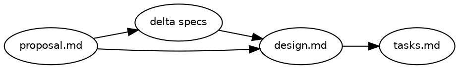
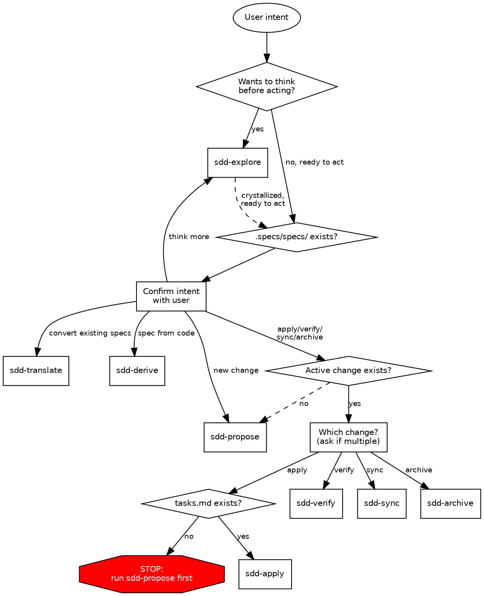

# SDD Skill Family Design

Spec Driven Development — a self-contained skill family for structured specification workflows.
Inspired by [Fission-AI/OpenSpec](https://github.com/Fission-AI/OpenSpec) but zero runtime dependency on it.

## Problem

No unified workflow for creating, managing, and implementing specifications in this repo.
OpenSpec provides good concepts (delta specs, artifact sequencing, change lifecycle) but comes with CLI dependency, config files, and rigidity that don't fit a skills-only approach.

## Goals

- Complete spec-driven development lifecycle as skills
- Zero external dependencies (no CLI, no config files)
- Fluid workflow — guide rather than gate (one exception: apply requires tasks)
- Explore-first culture — thinking before acting is always available
- Shared format reference eliminates duplication across child skills

## Non-Goals

- Compatibility with OpenSpec CLI or its directory structure
- Schema/config system for defining custom artifact flows
- Command-based invocation (`.claude/commands/`)

## Directory Convention

All SDD skills operate on `.specs/` at the project root:

```text
.specs/
├── specs/                          # Main specs (source of truth)
│   └── <capability>/
│       └── spec.md
└── changes/
    ├── <change-name>/              # In-progress changes
    │   ├── proposal.md
    │   ├── design.md
    │   ├── tasks.md
    │   └── specs/                  # Delta specs
    │       └── <capability>/
    │           └── spec.md
    └── archive/                    # Completed changes
        └── YYYY-MM-DD-<name>/
```

Rules:

- Main specs use baseline format — no delta markers
- Change specs use delta format — ADDED/MODIFIED/REMOVED/RENAMED sections
- A change is "active" if its directory exists under `.specs/changes/`
- A change is "complete" when all tasks are checked and delta specs are synced
- No config files.
  Artifact flow is hardcoded in the router skill.

## Artifact Flow



This is the recommended sequence.
The router warns when prerequisites are missing but does not hard-block, with one exception: `sdd-apply` requires `tasks.md` (hard gate).

## Skill Roster

### Parent: `sdd` (Router)

Routes user intent to the appropriate child skill.
Classifies by checking directory state and confirming with the user.

### Child Skills

| Skill           | Purpose                                                                                                | Writes to `.specs/`? |
| --------------- | ------------------------------------------------------------------------------------------------------ | -------------------- |
| `sdd-explore`   | Thinking partner — explore ideas, investigate problems, clarify requirements before or during any path | No                   |
| `sdd-translate` | Convert specs from other tools/formats into SDD baseline specs                                         | Yes (baseline)       |
| `sdd-derive`    | Generate SDD artifacts from user direction + existing code analysis                                    | Yes (both)           |
| `sdd-propose`   | Create a change with all artifacts (proposal, delta specs, design, tasks)                              | Yes (change dir)     |
| `sdd-apply`     | Implement tasks from tasks.md, checking them off as completed                                          | No (writes code)     |
| `sdd-verify`    | Verify implementation matches change artifacts — completeness, correctness, coherence report           | No (text output)     |
| `sdd-sync`      | Merge delta specs from a change into main specs intelligently                                          | Yes (main specs)     |
| `sdd-archive`   | Complete a change — remove or move the change directory                                                | Yes (deletes change) |

## Router Design

### Routing Flowchart



### Router Rules

1. Classify intent first — explore-or-act, then determine path
2. Infer bootstrap vs change mode from `.specs/specs/` existence, but **always confirm with user** before routing
3. One hard gate: `sdd-apply` requires `tasks.md`
4. Prefer minimal next step — don't run the full pipeline unless requested
5. Explore is mode-agnostic — available at every stage
6. Multiple active changes — ask the user which one before routing to apply/verify/sync/archive

### Sequence Warnings (Soft Gates)

| Action      | Expected prerequisite       | Warning if missing                                               |
| ----------- | --------------------------- | ---------------------------------------------------------------- |
| sdd-apply   | tasks.md                    | **Hard block** — "No tasks to implement. Run sdd-propose first." |
| sdd-verify  | completed tasks in tasks.md | "No tasks marked complete — nothing to verify yet."              |
| sdd-sync    | delta specs in change       | "No delta specs to sync."                                        |
| sdd-archive | all tasks complete          | "Incomplete tasks remain. Archive anyway?" (ask user)            |
| design.md   | proposal.md exists          | "Consider writing a proposal first for context."                 |

## Shared Resources

### Parent skill owns shared files

```text
skills/sdd/
├── SKILL.md
├── ATTRIBUTION.md
└── references/
    └── sdd-formats.md        # Spec format reference
```

### `sdd-formats.md` contents

Single reference doc defining:

- Baseline spec format (for `.specs/specs/`)
- Delta spec format (for `.specs/changes/<name>/specs/`)
- Proposal format
- Design format
- Tasks format
- RFC 2119 keyword usage (SHALL/MUST/SHOULD/MAY)
- Scenario format (GIVEN/WHEN/THEN)

### Child skill structure

```text
skills/sdd-<name>/
├── SKILL.md
└── references/
    └── sdd-formats.md → ../../sdd/references/sdd-formats.md  (where needed)
```

### Which children need the format symlink

| Skill         | Writes specs?          | Needs symlink? |
| ------------- | ---------------------- | -------------- |
| sdd-translate | yes (baseline)         | yes            |
| sdd-derive    | yes (both)             | yes            |
| sdd-propose   | yes (all artifacts)    | yes            |
| sdd-apply     | no (writes code)       | no             |
| sdd-explore   | no (thinking only)     | no             |
| sdd-verify    | no (reads only)        | no             |
| sdd-sync      | yes (edits main specs) | yes            |
| sdd-archive   | no (deletes)           | no             |

## Updates to Existing Skills

### sdd-translate

- All `openspec/` paths → `.specs/`
- Remove "OpenSpec-compatible" language → "SDD format"
- Remove Phase 4 (Initialize OpenSpec Config) entirely
- Replace inline format examples with reference to `references/sdd-formats.md`
- Update cross-references to sibling skills (`sdd-derive` not `openspec-specify`)

### sdd-derive

- All `openspec/` paths → `.specs/`
- Remove "OpenSpec artifacts" language → "SDD artifacts"
- Remove `config.yaml` creation from Phase 4B
- Update output type flowchart paths
- Replace inline format examples with reference to `references/sdd-formats.md`
- Update cross-references to sibling skills

## New Child Skills (Scope)

### sdd-explore

Thinking partner stance.
No fixed steps, no mandatory outputs.
Reads existing specs/changes for context.
Uses ASCII diagrams liberally.
Offers to capture insights into artifacts when decisions crystallize.
Available before any init path (derive, translate, propose) and during change work.
**Hard rule: no code.**
May read files and search code, but must never write code or implement features.
Creating SDD artifacts (proposals, designs, specs) is allowed — that's capturing thinking, not implementing.

### sdd-propose

Creates a change directory with all artifacts.
Reads `.specs/specs/` for context.
Asks user what to build.
Generates artifacts in dependency order: proposal → delta specs → design → tasks.
Heaviest skill in the family.

### sdd-apply

Implements tasks from `.specs/changes/<name>/tasks.md`.
Reads design and delta specs for context.
Checks off tasks as completed.
Hard gate: tasks.md must exist.

### sdd-verify

Reads change artifacts and codebase.
Three verification dimensions: completeness (tasks done, specs covered), correctness (implementation matches requirements), coherence (follows design decisions).
Three severity levels: CRITICAL/WARNING/SUGGESTION.
Graceful degradation based on which artifacts exist.
Build a minimal first pass; iterate after real-world use.

### sdd-sync

Agent-driven merge of delta specs into main specs.
Reads delta spec, reads main spec, applies changes intelligently.
Handles ADDED (insert), MODIFIED (partial update), REMOVED (delete), RENAMED (rename).
Preserves existing content not mentioned in delta.
Idempotent.
Build a minimal first pass; iterate after real-world use.

### sdd-archive

Checks completion status, warns if incomplete tasks remain.
Moves the change directory to `.specs/changes/archive/YYYY-MM-DD-<name>/`.
Fails if target already exists (suggest rename or wait).
Simple skill.

## Risks

- **Format drift**: If `sdd-formats.md` is updated but child skills reference stale assumptions inline, output will be inconsistent.
  Mitigation: child skills should reference the symlinked file, not duplicate format examples.
- **Verify/sync complexity**: These skills do the most inference-heavy work.
  Built as minimal first passes; expect iteration after real-world use.
- **Explore scope creep**: Explore's open-ended nature could lead to implementation leaking in.
  Mitigated by hard "no code" rule in skill scope.
