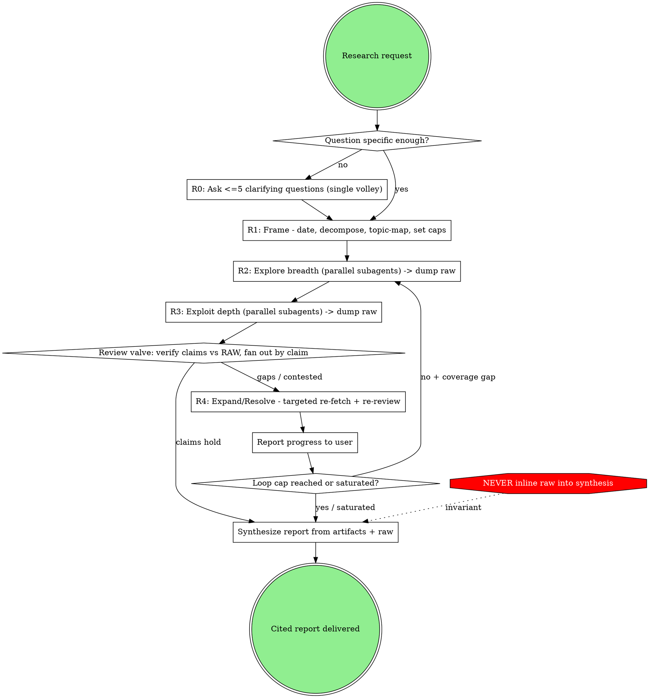

# Deep Research

## Invocation Notice

- Inform the user when this skill is being invoked by name: `deep-research`.

## Overview

`deep-research` runs a recursive, multi-round web investigation.
It fans out parallel subagents breadth-first then depth-first, runs an adversarial verification valve once per round, and synthesizes by re-deriving contested claims from retained raw sources rather than from a summary chain.
The loop is a double-diamond: each round alternates **diverge** (explore/expand) with **converge** (synthesize/review), repeating until findings saturate or the user's budget runs out.

Four invariants make this safe and cheap — they are load-bearing, not optional:

1. **Raw-to-disk.**
   Every fetch is dumped verbatim to a tmpfile.
   Subagents return only `{claim, source-url, raw-pointer, self-tag}` — never raw content upward.
2. **Review re-derives from raw.**
   The verification valve checks contested/load-bearing claims against the raw tmpfiles, never against the distilled findings ledger.
3. **Review fans out by claim.**
   "Once per round" is a _cadence_, not a single monolithic pass: extract atomic claims, dispatch one skeptic per claim (or small batch).
4. **Synthesis reads artifacts; the user reads progress.**
   Progress prose is for the human and must never become a synthesis input — the ledger + topic-map + raw are the lossless memory.

## Harness Assumptions

This skill assumes three harness primitives.
Substitute your harness's equivalents and gate each on availability:

- **Parallel subagent dispatch** — the fan-out engine for explore/exploit/verify.
  If unavailable, run dimensions sequentially in-context, but still honor raw-to-disk so the synthesis window stays clean.
  This skill's dispatch cadence, model-tier map, and verification valve are purpose-built for research and take precedence over any general subagent skill (e.g. `subagent-patterns`) during a research run.
- **Web search and fetch tools** — native or MCP (see Tool Selection).
- **A user-question primitive** for Round 0 (for example `AskUserQuestion`).
  If unavailable, ask in plain text and wait.

## When to Use

- A question that needs many sources, cross-checking, and a structured cited report.
- "What's the current state / landscape / consensus on X?"
- Claims that must be verified, not just collected; topics with active disagreement.
- Time-sensitive topics where recency and temporal precision matter.

## When Not to Use

- Single-fact lookups or quick answers — just search directly.
- Library, API, SDK, dependency, or version questions — use `mcp-research`.
- Open-ended ideation with no anchor — use `brainstorming`.
- Reading/auditing a local codebase — use code search tools.

## The Loop

Rendered: `assets/the-loop.svg`.

| Round | Name                  | Fan-out  | Review                      | Notes                                                                                                                                                                                                |
| ----- | --------------------- | -------- | --------------------------- | ---------------------------------------------------------------------------------------------------------------------------------------------------------------------------------------------------- |
| 0     | **Clarify**           | —        | —                           | Up to 5 questions, **single volley**. Weave answers in, then proceed. Includes the **depth/budget question** (the dominant cost lever — the user owns it). Skip if the question is already specific. |
| 1     | **Frame**             | no       | —                           | Check current date; map intent→temporal precision; decompose into dimensions; write `topic-map` + empty `findings-ledger`; set loop cap.                                                             |
| 2     | **Explore** (breadth) | yes      | no                          | One subagent per dimension. Each searches widely, dumps raw to tmpfiles, returns pointers. Converge: update topic-map (themes, dead ends, gaps).                                                     |
| 3     | **Exploit** (depth)   | yes      | **yes**                     | Deep-dive subagents on high-value threads + follow-the-thread. Converge: draft by-theme; flag conflicts/gaps. **Review valve fires here** (see below).                                               |
| 4     | **Expand/Resolve**    | targeted | re-review new material only | Triggered by the review valve. Targeted re-fetch (contested claim) or a new dimension (coverage gap). **Single round, but can loop → R2**, bounded by the cap.                                       |
| —     | **Synthesize**        | —        | —                           | Terminal. Report organized by theme, graded epistemics, conflicts side-by-side, every claim carries a pointer.                                                                                       |

Per-round mechanics, artifact schemas, dispatch templates, and the model-tier map: see `references/round-playbook.md`.

## The Review Valve

Fires **once per round at the converge moment** (end of R3, and on R4 material) — not per subagent.
It is the seam where the loop (R3/R4) reads the memory (raw tmpfiles) under the rule (re-derive, don't trust the summary).
Verify only **load-bearing, contested, surprising, or single-source** claims — not everything.
Each verified claim gets a verdict (Supported / Partial / Unsupported / Uncertain) and a confidence.
Sufficient unresolved questions trigger R4.
Full procedure, claim-selection criteria, verdict rubric, and conflict-resolution rules: see `references/verification.md`.

## Tool Selection — use everything available

**Inventory the search/retrieve tools present at runtime and prefer the richest set** — do not default to whatever the harness ships natively.
A dedicated research or extraction tool (often MCP-provided) usually beats a generic web fetch on coverage and clean output.
If tools are deferred or hidden, discover and load them first (for example via a tool-search primitive) before dispatching subagents.

Map the tools you have to these capability needs; native search/fetch is the floor when nothing richer is available:

| Capability need      | What to look for (examples, not an exhaustive list)                         |
| -------------------- | --------------------------------------------------------------------------- |
| Broad web discovery  | a web-search tool — dedicated search APIs (e.g. Exa, Jina) or native search |
| Full page extraction | a clean-extraction reader (e.g. Jina read, Exa fetch) or native fetch       |
| Code-centric sources | a code-context search tool, otherwise web search                            |
| Papers / PDFs        | an academic-search or PDF-extraction tool (e.g. arXiv search, PDF extract)  |
| Library / API docs   | a docs tool (e.g. Context7), otherwise web fetch                            |

Directives:

- **Read full sources, not snippets.**
  Search snippets locate; only a full fetch grounds a claim.
- **Cross-source corroboration is mandatory for web claims** — no native provenance to lean on.
- Subagents own all token-heavy retrieval; the orchestrator and synthesizer never call retrieval
  tools directly (keeps the synthesis window clean — invariant 1).

## Keeping the User Updated

- After Round 1, state the plan in one short message: dimensions, loop cap, rough scope.
- **Emit a progress checkpoint after each R4 loop**: a _diff of the ledger_ — what resolved this loop, what is still contested, "loop N of cap M", and an explicit continue-or-synthesize prompt.
  This is the human-in-the-loop stop gate and where the budget cap is honored interactively.
- Keep checkpoints terse and derived from the ledger.
  **Never** re-summarize source content into them, and never feed checkpoint prose back into synthesis (invariant 4).

## Output

A cited report (see `references/temporal-and-output.md` for the full contract):

- **Organized around themes**, not walked through source by source.
- **Graded epistemics**: established / active debate / speculation, with confidence levels.
- **Conflicts presented side-by-side** with verdicts — never silently collapsed to one answer.
- **Every claim carries a pointer** to its source URL (and raw tmpfile during the run).
- Explicit **gaps and limitations** section.

## Related Skills

Hand off or compose at these flow points:

- **brainstorming** — _before_ R0, when the question itself is unformed and you do not yet know what to research.
  R0 only narrows a researchable question; it does not shape a fuzzy premise.
- **mcp-research** — _mid-research_, when a sub-question is a library, API, SDK, or version lookup.
  Its docs-first tool selection applies within that thread.
- **antislop-writing** — at Synthesize, to tighten the report.
  The report is prose a human reads, so its heading-claim and lead-with-the-point rules apply (they do not apply to this skill file).
- **editorial-review** — _after_ the report, only if it advances a thesis or recommendation worth pressure-testing.
  A pure findings catalog does not need it.

## References

- `references/round-playbook.md` — per-round steps, artifact schemas (topic-map, findings-ledger,
  tmpfile/pointer), subagent dispatch templates, model-tier map, saturation definition.
- `references/verification.md` — review valve procedure, claim selection, verdict taxonomy,
  evidence-strength, conflict resolution, single-source/replication flags.
- `references/temporal-and-output.md` — intent→temporal-precision table, date phrasing, report
  contract and skeleton.
