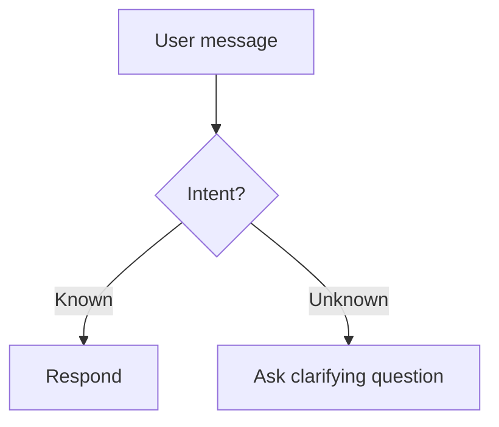

# Chatbot Mermaid Guidelines

## Diagram selection

- Use `flowchart TD` for high-level conversation paths and branching logic.
- Use `sequenceDiagram` for message exchanges, latency, and tool calls.
- Use `stateDiagram-v2` for dialog states, persistence, and recovery paths.

## Layout and readability

- Prefer top-down (`TD`) or left-to-right (`LR`) based on width constraints.
- Keep labels under ~40 characters when possible.
- Use short node IDs and human-readable labels: `A[User asks]`.
- Group related steps with subgraphs only when it improves clarity.

## Chatbot flow conventions

- Represent user input as `User` or `U`.
- Represent bot/system as `Bot` or `Assistant`.
- Represent tools or external systems as distinct nodes (e.g., `Tool`, `DB`, `API`).
- Add explicit error and fallback paths (e.g., validation failure, tool timeout).

## Mermaid block template

