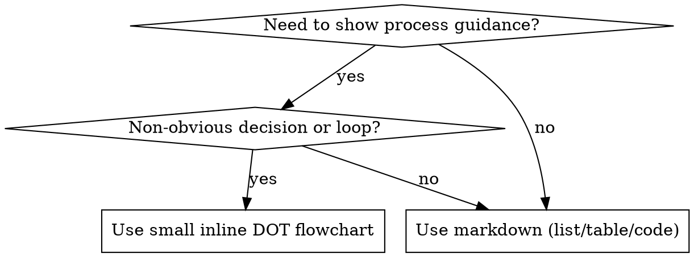

# Optimizing Skills

Use this skill to create, review, or improve SKILL.md-based skills with strong triggering, clear workflows, and efficient context use.

## Overview

### What is a Skill?

A **skill** is a reference guide for proven techniques, patterns, or tools, typically classed as procedural knowledge or best practices.
Skills help future Agent instances find and apply effective approaches.

**Skills are:** Reusable techniques, patterns, tools, reference guides

**Skills are NOT:** Narratives about how you solved a problem once

### When to Create a Skill

**Create when:**

- Technique wasn't intuitively obvious to you or required multiple iterations to get right.
- You'd reference this again across projects / Others would benefit from knowing this.
- Pattern applies broadly (not project-specific)
- Triggerable by specific user intents or common failure modes.

**Don't create for:**

- One-off solutions
- Standard practices well-documented elsewhere
- Project-specific conventions that aren't broadly applicable

## Workflow

1. Define 2-3 concrete use cases and the phrases that should trigger the skill.
2. Identify reusable resources (scripts, references, assets).
3. Draft frontmatter with a trigger-focused `description`.
4. Write imperative SKILL.md instructions.
5. Offload details to references/scripts/assets; keep SKILL.md lean.
6. Test triggering and functional behavior; capture failures and iterate.

## Core Principles

- Optimize for triggering: description should emphasize when to use the skill (`references/skills-search-optimization.md`).
- Keep frontmatter metadata small (about 100 tokens combined).
- Keep main `SKILL.md` under 500 lines; move deep detail into references.
- Keep SKILL.md concise; move heavy reference material into `references/` or `assets/`.
- Use progressive disclosure: metadata -> SKILL.md -> references/scripts/assets.
- Choose the right degree of freedom: text, pseudocode, or scripts depending on fragility.
- Prefer reusable resources (scripts, templates) over repeated prose.

### Progressive Disclosure Targets

- Metadata (`name` + `description`): small startup footprint, ideally ~100 tokens.
- `SKILL.md`: keep actionable and concise, target \<5000 tokens and \<500 lines.
- `scripts/`, `references/`, `assets/`: loaded only when needed; keep files narrow so agents pull less context.

## Flowchart Usage



**Use flowcharts only for:**

- Complex processes with multiple steps and branches.
- Non-obvious decision points.
- "When to use A vs B" routing choices.

**Do not use flowcharts for:**

- Reference material (use tables/lists).
- Code examples (use fenced code blocks).
- Linear instructions (use numbered steps).
- Placeholder node labels without semantic meaning.

Use `references/graphviz-conventions.dot` for style rules.

Render DOT to SVG with `scripts/render-dot.py`.
Output SVGs are written to the target skill's `assets/` directory.

```bash
scripts/render-dot.py skills/optimize-skills/references/skill-workflow.dot
scripts/render-dot.py skills/optimize-skills/SKILL.md
scripts/render-dot.py skills/optimize-skills/SKILL.md --force # overwrite existing SVGs
```

## Output

### SKILL.md Structure

```txt
skills/
  skill-name/
    SKILL.md      # Main reference (required)
    assets/       # (optional) Static reusable resources such as templates or figures
    references/   # (optional) On-demand documentation, organizedby topic or variant
    scripts/      # (optional) Executable helpers for deterministic tasks;
                  # scripts should be self-contained or clearly declare dependencies,
                  # include clear errors, and handle edge cases.
```

### Rules

- SKILL.md must be named exactly `SKILL.md`.
- Folder name must be kebab-case, matching the `name` in frontmatter.
- Do not add README.md inside the skill.
- YAML frontmatter must include `name` and `description` fields:"
  - `name`: kebab-case, matches folder name.
  - `description`: emphasize when to use the skill; include triggers and symptoms.
- Avoid workflow summaries in the description.
  Keep it short and specific.

### Suggested SKILL.md Template

```markdown
---
name: skill-name
description: Brief, trigger-focused description of the skill's purpose and when to use it.
---

# Skill Name

## Overview

Brief description of the skill and its purpose in 1-2 sentences.

## When to Use

[optional] (small) inline flowchart if decision matrix is non-obvious or complex

Bulleted list of triggers (symptoms, use cases) When not to use

## Workflow

Step-by-step instructions: Link out to assets, references, scripts to keep SKILL.md concise.
Leverage flowchart guidance for complex processes.

## Output

Expected results, artifacts, or outcomes from following the workflow.

## Common Mistakes

List of pitfalls, common errors to avoid, and how to fix/resolve them.

## References

Links to related documentation, scripts, templates, or external resources and hints on when to consult each.
```

## Common Mistakes

- Each Skill has exactly one description field.
  The description is critical for skill selection: Claude uses it to choose the right Skill from potentially 100+ available Skills.
  Your description must provide enough detail for Claude to know when to select this Skill, while the rest of SKILL.md provides the implementation details.

- Keep workflows trigger-based and split into focused subgraphs rather than one giant flow.

## References

- `references/best-practices.md` for general guidance on writing, structuring, and optimizing skills.

- `references/skills-search-optimization.md` for specific patterns on optimizing for search and triggering.

- `references/skill-workflow.dot` for a workflow definition of this skill.
  Use with `references/graphviz-conventions.dot` for styling rules.

- Triggering and description writing patterns

- Testing and iteration checklists

- Troubleshooting under/over-triggering

- When to split content into references or scripts

- Token and context budget guidance
