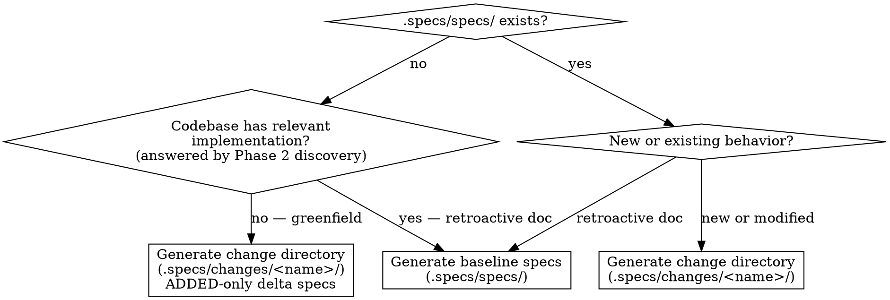
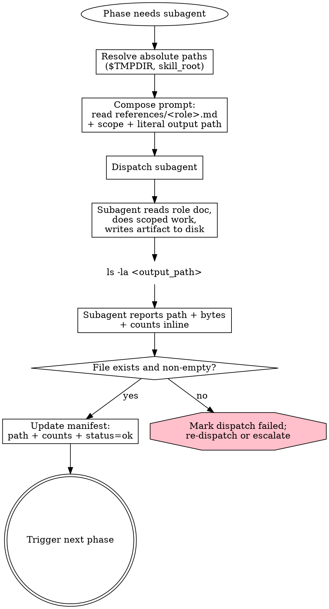
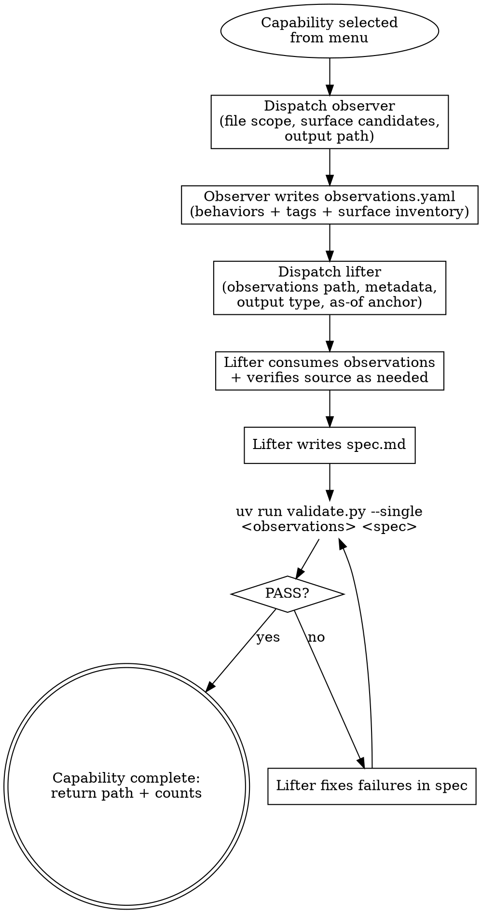

# SDD Derive

Orchestrate spec generation from existing code: a change directory (new or modified behavior) or baseline specs (retroactive documentation).

The orchestrator holds context across phases; subagents are dispatched for scoped work that benefits from context isolation.

> `SPECS_ROOT` is resolved by the `sdd` router before this skill runs.
> Replace `.specs/` with the project's actual specs root.

## Invocation Notice

- Inform the user when this skill is being invoked by name: `sdd-derive`.

## When to Use

- Deriving specs from existing code ("derive SDD specs for the auth flow")
- Documenting implemented behavior retroactively into baseline specs
- Producing a change directory for behavior already implemented
- User phrases: "derive specs", "generate specs from code", "retrofit specs", "document this code in SDD"

## When Not to Use

- Translating specs from another tool or format — use `sdd-translate`
- No codebase and no existing behavior to anchor against — use `sdd-propose`
- Exploring a problem before deciding what to spec — use `sdd-explore`

## Determine Output Type

Baseline specs (`.specs/specs/`) document **implemented** behavior.
Write baseline specs only when existing code anchors them; otherwise generate a change directory.



**Greenfield check:** when `.specs/specs/` does not exist, run discovery (Phase 2) before deciding.
If discovery finds no relevant implementation, generate a change directory with ADDED-only delta specs — never assert behavior in `.specs/specs/` that has not been built.

## Workflow

### Checklist

- [ ] Phase 1: Understand User Intent
- [ ] Phase 2: Discovery (explore + synthesize)
- [ ] Phase 3: Pre-flight Consent
- [ ] Phase 4: Per-Capability Derive (Observe + Lift)
- [ ] Phase 5: Validate
- [ ] Phase 6: Generate Output

### Subagent Protocol

**Persist before returning.**
Every subagent MUST write its output to disk unconditionally.

**Resolve paths before dispatch.**
The orchestrator MUST expand `$TMPDIR` and other shell variables in the prompt; subagents do not consistently expand them, and literal `$TMPDIR` produces silent write failures.

**Verify writes inline.**
Every subagent prompt MUST require `ls -la <path>` after writing and report byte count.
The orchestrator confirms the file exists before treating dispatch as successful.

**Dispatch by reference, not inline duplication.**
Role discipline lives in `references/<role>.md`.
Resolve the skill's install path (e.g., `~/.claude/skills/sdd-derive/`, `.claude/skills/sdd-derive/`, or a plugin directory) and substitute it into the template.
Subagents inherit Read permissions from the parent.

```markdown
Read `<resolved_skill_root>/references/<role>.md` and follow it as your job description.
Below is your specific scope.

Capability: `<name>` \
Files in scope: `<list>` \
External-surface candidates: `<list>` \
Output path: `<literal absolute path>` \

After writing, run `ls -la <path>` and report byte count.
```

**Return decision-relevant data, not artifact content.**
Full artifacts live on disk; the orchestrator reads the file when it needs detail.
The synthesizer is the exception — its capability menu is structured, bounded, and required for Phase 3.

| Subagent    | Return inline                                                                             |
| ----------- | ----------------------------------------------------------------------------------------- |
| Explorer    | path written, byte count, technique, finding count, anomalies                             |
| Synthesizer | **full capability menu** (Phase 3 needs it), path written, byte count                     |
| Observer    | path written, byte count, observation count, surface item count, anomalies                |
| Lifter      | path written, byte count, requirement count, scenario count, uncertainty count, anomalies |

**Track a manifest, not content.**
Decide what runs, track completed paths + counts + status, detect failures, trigger the next phase.
Never re-ingest all artifacts at once.



### Phase 1: Understand User Intent

Extract from the request:

- **Which capability(s)** does this touch?
  (auth, payments, UI, etc.)
- **What behavior** is being specified?
  (new, modified, retroactive)
- **In scope vs. out of scope?**
  Ask one targeted question if truly ambiguous.

Don't speculate on large surface areas — confirm scope before generating anything.

### Phase 2: Discovery

Two sequential calls:

1. **`discovery-explore`** — fan out parallel explorers, one per technique (call graph, naive AST, data-flow / channel, port/interface, schema artifacts, test-suite).
   Each emits structured findings.
2. **`discovery-synthesize`** — single synthesizer consumes all explorer outputs and produces a **capability menu** (candidates with file scope and cost, overlaps, external-surface candidates, axis disagreements, gotchas).

See `references/discovery.md` for the explorer schema, synthesizer expectations, and loop semantics.

**One-time tooling suggestions.**
Check `.specs/.sdd/suggested-tools` and present each suggestion below at most once (append the marker after presenting; create the file/dir if needed).
If declined or already listed, skip and proceed with reduced fidelity.

> **`code-review-graph` (first run only):**
> CLI that builds a structural AST graph of the codebase, improving call-graph discovery with communities, bridge nodes, and impact-radius signals. Install: `uv tool install code-review-graph`. Without it, the call-graph explorer falls back to naive AST traversal. Say "skip" to dismiss.
>
> **`schema-config` (first run only when schemas detected):**
> Detected schema artifacts: `<files>`. Create `.specs/.sdd/schema-config.yaml` to configure schema extraction commands — enables snapshot generation, drift detection, and authored-vs-generated diffs. See `references/sdd-schema.md` § 3 for the format. Without it, the schema-artifact explorer runs detection-only. Say "skip" to dismiss.

### Phase 3: Pre-flight Consent

Users typically lack architectural ground-truth for overlap-ownership and external-surface classification.
The orchestrator commits sensible defaults silently and only escalates on flagged conditions.

**Defaults (applied silently unless escalation fires):**

- Pre-select all candidates with `confidence >= medium`.
- Overlap primary-owner: capability with most edges to the bridge wins; ties broken alphabetically.
- External-surface owned vs 3rd-party: take each candidate's classification when explorer confidence ≥ medium.

**Escalation conditions (orchestrator MUST prompt):**

- Single-cluster degeneracy flagged by the synthesizer.
- Axis disagreements between explorers on capability boundaries.
- Universally low confidence (< medium across the menu).
- Cost threshold exceeded — capability count > 6 OR file count > 100.
- External-surface classification has medium-vs-high split.

When no escalation fires, present a brief summary (capabilities + counts + cost) and proceed.
When any fires, present only the flagged item and ask one targeted question.

**Loop semantics:** if the user requests refinement, clarify the request unless unambiguous.
Refinement options:

- Re-run synthesizer alone — cheap; preferred for "treat A and B as one"
- Re-run a specific explorer with adjusted scope — medium; for "ignore vendor/"
- Re-run all explorers — expensive; only for substantive scope changes

### Phase 4: Per-Capability Derive

For each selected capability, dispatch sequentially:

1. **Observer** — reads the capability's file scope.
   Emits observations list (behavior-grain, with code references, evidence-class tags, confidence) and surface inventory.
   See `references/observer.md`.
2. **Lifter** — reads observations + surface inventory + capability metadata.
   Has bounded source access for **verification only**.
   Emits lifted contracts and spec content (delta or baseline format), plus optional `## Uncertainties` section.
   See `references/lifter.md`.

Capabilities run in parallel across each other; observer/lifter is sequential within a capability.



### Phase 5: Validate

Validation runs in two places.

**Per-capability** — each lifter runs the validator before returning:

```bash
uv run --quiet <skill_root>/references/validate.py --single <observations.yaml> <spec.md>
```

If FAIL, the lifter fixes and re-runs until PASS — catching format drift at write time avoids round-tripping a corrective dispatch.
See `references/lifter.md` § Self-check.

**Aggregate** — the orchestrator runs across the whole run:

```bash
uv run --quiet <skill_root>/references/validate.py <observations_dir> <specs_dir>
```

The aggregate report covers format, YAML parse, kind-aware surface coverage diff, and uncertainty review.
If lifters did their self-check, format/YAML failures should be zero — failures here indicate a skipped self-check.
Surface gaps and uncertainty totals are the substantive output.

If a spec fails format at this stage, dispatch a corrective lifter pass with the failures cited.
If an observation YAML fails parse, dispatch a corrective observer pass.
See `references/validate.md` for severity rules and report format.

### Phase 6: Generate Output

Write the spec artifacts.
Add a generation note at the top:

> Generated from code analysis on {date}, as-of commit {sha}

Clear ephemeral observations once specs are written.
The commit SHA is the canonical anchor for re-derivation.

See `references/derive-spec-additions.md` for the `## Uncertainties` section format and as-of anchor placement.

## Output

**Change directory (new/modified behavior):**

- `.specs/changes/<name>/proposal.md`
- `.specs/changes/<name>/specs/<capability>/spec.md` (delta format)
- `.specs/changes/<name>/tasks.md` (when applicable)

**Baseline specs (retroactive):**

- `.specs/specs/<capability>/spec.md` per capability

`sdd-derive` produces a **partial** change directory — no `design.md`.
Use `sdd-propose` for a full artifact set.

Report after generation: capabilities covered, requirement count, uncertainties count, surface coverage gaps.

## Common Mistakes

- **Skipping the lift step** — writing requirements directly from observations.
  The lifter translates "what code does" to "what property the code maintains" per `references/evidence-class-taxonomy.md`.
- **Promoting an algorithm to a contract** — when `algorithmic` is set, apply the strategy check and emit an Uncertainty.
- **One massive spec for a large surface** — discovery's capability menu is the decomposition; respect it.
- **Lifter exploring instead of verifying** — source access is reactive, not proactive.
  See `references/lifter.md` § Verification Discipline.
- **Wrong format for the output type** — delta in `.specs/specs/`, or baseline in a change dir.
- **Baseline specs in greenfield** — `.specs/specs/` asserts implemented behavior; if nothing is built, use a change directory with ADDED-only delta specs.
- **Mid-run truncation** — if a capability is too large to observe in one pass, split before dispatch (Phase 3).
  Never silently truncate.

## References

- `references/discovery.md` — explorer schema, synthesizer expectations, loop semantics
- `references/evidence-class-taxonomy.md` — tag definitions and composition rules
- `references/observer.md` — observation entry shape, surface inventory, observer prompt
- `references/lifter.md` — lift rules per tag, verification discipline, lifter prompt
- `references/validate.md` — surface coverage diff, Phase 7 checklist
- `references/derive-spec-additions.md` — `## Uncertainties` and as-of anchor (derive-specific)
- `references/sdd-spec-formats.md` — baseline, delta, scenario formats (shared)
- `references/sdd-change-formats.md` — proposal, design, tasks formats (shared)
- `references/sdd-schema.md` — schema artifacts and lifecycle (shared)
- `references/sdd-derive-output-type.dot` — DOT source for the output type decision
- `references/sdd-derive-subagent-dispatch.dot` — DOT source for the subagent dispatch lifecycle
- `references/sdd-derive-phase-2-discovery.dot` — DOT source for the Phase 2 explore/synthesize/refinement loop
- `references/sdd-derive-phase-4-per-capability.dot` — DOT source for the Phase 4 observer/lifter/self-validate flow
