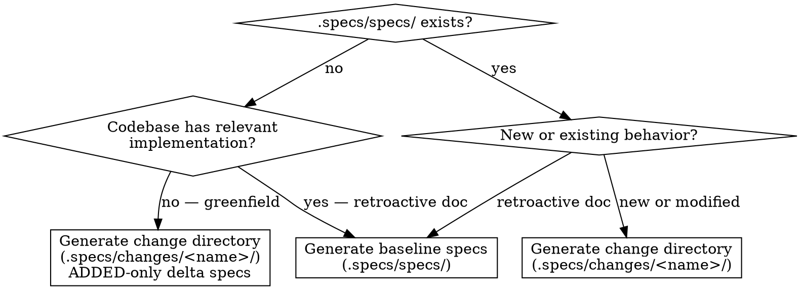

# SDD Derive

Generate SDD artifacts from user intent and existing code.
Produces either a change directory (for new/modified behavior) or baseline specs (for retroactive documentation).

This skill is an **orchestrator** that coordinates a multi-phase workflow.
The orchestrator holds full context across phases; subagents are dispatched for scoped work that benefits from context isolation.

> `SPECS_ROOT` is resolved by the `sdd` router before this skill runs.
> Replace `.specs/` with your project's actual specs root in all paths below.

## Invocation Notice

- Inform the user when this skill is being invoked by name: `sdd-derive`.

## When to Use

- User describes a feature to specify: "derive SDD specs for the auth flow"
- User wants a change directory for a new feature against an existing codebase
- User wants retroactive specs documenting existing behavior
- User says "spec this out", "create an SDD change for X", "document this in SDD"

## When Not to Use

- Translating specs from another tool — use `sdd-translate`
- No codebase and no existing behavior — use `sdd-propose` directly
- Exploring a problem before deciding what to spec — use `sdd-explore`

## Determine Output Type

Baseline specs (`.specs/specs/`) document **implemented** behavior — they are the source of truth for what the codebase currently does.
Only write baseline specs when there is existing code to document.
If the codebase has no relevant implementation yet, all specs are aspirational and belong in a change directory.



**Greenfield check:** When `.specs/specs/` does not exist, run discovery (Phase 2) before deciding output type.
If discovery finds no relevant implementation for the target capability, generate a change directory with ADDED-only delta specs — not baseline specs.
This prevents `.specs/specs/` from asserting behavior that hasn't been built yet.

## Workflow

### Checklist

- [ ] Phase 1: Understand User Intent
- [ ] Phase 2: Discovery (explore + synthesize)
- [ ] Phase 3: Pre-flight Consent
- [ ] Phase 4: Per-Capability Derive (Observe + Lift)
- [ ] Phase 5: Validate
- [ ] Phase 6: Generate Output

### Subagent Protocol

**Subagents always write to disk.**
Every subagent (explorer, synthesizer, observer, lifter) persists its output before returning.
This is unconditional — not gated by capability count or workflow size.

**Output paths are literal absolute paths — never variables.**
The orchestrator MUST resolve `$TMPDIR` (and any other shell variables) before composing a subagent prompt.
Subagent prompts MUST contain literal absolute paths only — `/tmp/claude-501/sdd-derive/<run-id>/...`, never `$TMPDIR/...`.
Subagents do not consistently expand shell variables; passing the literal `$TMPDIR` produces silent write failures or splits artifacts across `/tmp`, `/var/tmp`, and `$TMPDIR` resolutions.

**Subagents must verify their write and report the byte count.**
Every subagent's prompt MUST require a verification step: after writing, run `ls -la <path>` and report the byte count inline.
The orchestrator MUST check that the file exists at the expected path before treating the dispatch as successful.
A subagent that reports "path written" without verification has not necessarily written anything.

**Subagents read references directly; orchestrator passes only scope.**
Role-specific instructions (observer discipline, lifter rules, etc.) live in `references/<role>.md` and are dispatched by reference, not by inline duplication.
The orchestrator's subagent prompt is roughly:

> Read `/absolute/path/to/skills/sdd-derive/references/<role>.md` and follow it as your job description. Below is your specific scope.
>
> Capability: `<name>`
> Files in scope: `<list>`
> External-surface candidates (user-confirmed): `<list>`
> Output path: `<literal absolute path>`
>
> After writing, run `ls -la <path>` and report byte count.

This keeps orchestrator prompts ~80 words each and centralizes role discipline in one canonical location.

**Subagents return decision-relevant data, not artifact content.**
Full artifact prose (observation lists, spec text, validation details) lives on disk.
What the orchestrator needs inline varies by subagent role:

| Subagent    | Return inline                                                                             |
| ----------- | ----------------------------------------------------------------------------------------- |
| Explorer    | path written, byte count, technique, finding count, anomalies                             |
| Synthesizer | **full capability menu** (needed for Phase 3 consent), path written, byte count           |
| Observer    | path written, byte count, observation count, surface item count, anomalies                |
| Lifter      | path written, byte count, requirement count, scenario count, uncertainty count, anomalies |

The synthesizer is the exception: its capability menu is structured, bounded, and the orchestrator must present it to the user — return it inline.
For all other subagents, if the orchestrator needs more detail than the summary provides, it reads the specific file.

**The orchestrator tracks a manifest, not content.**
The orchestrator's job is: decide what runs, track what completed (file path + counts + status), detect failures, and trigger the next phase.
It never holds artifact text in context — that lives on disk.
To review or act on a specific artifact, the orchestrator reads or searches within that one file.
It does not re-ingest all outputs at once.

### Phase 1: Understand User Intent

Extract from the request:

- **Which capability(s)** does this touch?
  (auth, payments, UI, etc.)
- **What behavior** is being specified?
  (new feature, modification, retroactive doc)
- **What's in scope vs. out of scope?**
  Ask one targeted question if truly ambiguous.

Don't speculate on large surface areas — confirm scope before generating anything.

### Phase 2: Discovery

Discovery is a phase, not a single subagent.
The orchestrator makes two sequential calls:

1. **`discovery-explore`** — fan out parallel explorer subagents, one per technique (call graph, naive AST, data-flow / channel inventory, port / interface inventory, schema artifacts, test-suite — see `references/discovery.md` for the full set and per-explorer guidance).
   Each explorer emits structured findings using the explorer schema.

2. **`discovery-synthesize`** — single synthesizer subagent consumes all explorer outputs, reconciles agreements and disagreements, and produces a **capability menu** containing:

   - Candidate capabilities with file scope and cost estimate
   - Overlaps between capabilities (call graph + state coupling)
   - External-surface candidates (consumed and exposed)
   - Axis disagreements (where explorers disagreed about boundaries)
   - Gotchas (god-modules, single-cluster degeneracy, missing language coverage, etc.)

See `references/discovery.md` for the full explorer schema, synthesizer expectations, and loop semantics.

**One-time suggestion:** Check `.specs/.sdd/suggested-tools`.

- If `code-review-graph` is not listed: present the suggestion below, then append `code-review-graph` to that file (create the file and directory if needed).
  Do this once and only once.
- If already listed: skip the suggestion.

> **Suggestion (first run only):**
> `code-review-graph` is a CLI tool that builds a structural AST graph of your codebase. It improves discovery's call-graph explorer with communities, bridge nodes, and impact-radius signals. Install: `uv tool install code-review-graph`. Say "skip" to dismiss. This won't appear again.

If `code-review-graph` is not installed, the call-graph explorer falls back to a naive AST traversal — discovery still functions, with reduced fidelity for community detection.

**Schema config suggestion (when applicable, one-time):** if the schema-artifact explorer detected schema files (OpenAPI, Protobuf, GraphQL, SQL schemas, etc.) and `.specs/.sdd/schema-config.yaml` does not exist, present the suggestion below.
This is a separate one-time prompt from the `code-review-graph` suggestion above; track via `.specs/.sdd/suggested-tools` with the marker `schema-config`.

> **Suggestion (first run only when schemas detected):**
> Detected schema artifacts: `<files>`. Consider creating `.specs/.sdd/schema-config.yaml` to configure schema extraction commands. This enables the schema-artifact explorer to generate snapshots, diff authored vs generated schemas, and surface drift. See `references/sdd-schema.md` § 3 for the format. Say "skip" to dismiss. This won't appear again.

If declined, the schema-artifact explorer reports `not_applicable` for snapshot generation and runs detection-only.

### Phase 3: Pre-flight Consent

Users typically lack the architectural ground-truth to answer overlap-ownership and external-surface-classification questions.
The orchestrator therefore commits sensible defaults and only escalates to the user on flagged conditions.

**Default decisions (applied silently unless an escalation condition fires):**

- **Capability selection** — pre-select all candidates with `confidence >= medium` from the synthesizer's menu.
- **Overlap primary-owner** — capability with the most edges to the bridge wins; ties broken alphabetically.
- **External-surface owned vs 3rd-party** — take each candidate's classification as-is when explorer confidence is `>= medium`.

**Escalation conditions (orchestrator MUST prompt the user):**

- **Single-cluster degeneracy** flagged by the synthesizer (decomposition is non-trivial; user picks the partitioning axis).
- **Axis disagreements** between explorers on capability boundaries (user resolves which boundary to keep).
- **Universally low confidence** on capability candidates (< medium across the menu).
- **Cost threshold exceeded** — capability count > 6 OR file count > 100.
  Show estimated dispatches and file count; user confirms before proceeding.
- **External-surface classification has medium-vs-high split** (e.g., one explorer says owned, another says 3rd-party).

When no escalation condition fires, present a brief summary (capabilities + counts + cost) and proceed.
When any condition fires, present only the flagged item and ask one targeted question.

**Loop semantics:** if the user requests refinement, the orchestrator must clarify the request unless it is entirely unambiguous.
Refinement options:

- Re-run synthesizer alone with new instructions (cheap — preferred for "treat A and B as one")
- Re-run a specific explorer with adjusted scope (medium — for "ignore vendor/")
- Re-run all explorers (expensive — only if scope changes substantively)

### Phase 4: Per-Capability Derive

For each selected capability, dispatch sequentially:

1. **Observer subagent** — reads the capability's file scope (community + bridges + schema/test artifacts).
   Emits:

   - **Observations list** (behavior-grain entries with code references, evidence-class tags, confidence)
   - **Surface inventory** (env vars, CLI flags, public routes, exported symbols, etc.)

The observer's full job description lives in `references/observer.md`.
The orchestrator dispatches by reference (see § Subagent Protocol), passing only the per-capability scope.

2. **Lifter subagent** — reads observations + surface inventory + capability metadata.
   Has bounded source access for **verification** (not exploration).
   Emits:

   - Lifted contracts and spec content (delta or baseline format per Output Type decision)
   - Optional `## Uncertainties` section (omitted when empty)

   The lifter's full job description (lift rules per tag, verification discipline, self-check checklist) lives in `references/lifter.md`.

Capabilities run in parallel across each other; observer/lifter is sequential within a capability.

### Phase 5: Validate

Validation runs in two places — at the lifter (per capability, before return) and at the orchestrator (across the whole run).

**Per-capability validation (lifter, in Phase 4).**
Each lifter runs the validator against its own output before returning:

```bash
uv run --quiet <skill_root>/references/validate.py --single <observations.yaml> <spec.md>
```

If the validator returns FAIL, the lifter fixes the listed failures and re-runs until PASS.
This catches format drift at write time and avoids round-tripping a corrective lifter pass through the orchestrator.
See `references/lifter.md` § Self-check before returning.

**Aggregate validation (orchestrator, this phase).**
After all capabilities have lifted, the orchestrator runs the validator across the whole run:

```bash
uv run --quiet <skill_root>/references/validate.py <observations_dir> <specs_dir>
```

The aggregate report covers:

- **Format check** (regex) — generation note, `## Purpose` (baseline), `### Requirement: <Name>` headings, `#### Scenario:` blocks with bold `**GIVEN**`/`**WHEN**`/`**THEN**`, no delta markers in baseline, `## Uncertainties` only-when-non-empty.
- **YAML parse check** — every observation YAML must `yaml.safe_load` cleanly; failures surface file:line.
- **Surface coverage diff** (kind-aware) — public-consumer surfaces (`http_route`, `cli_command`, `published_event`, `exported_symbol`) absent from spec are **gaps**; internal-knob surfaces (`env_var`, `config_key`, `cli_flag`) absent are **acknowledged-without-scenario** (lift discipline correctly excludes most config from contracts).
- **Uncertainty review** — count items in each spec's `## Uncertainties` section.

The aggregate run should be a no-op for format/YAML if lifters did their per-capability validation — failures here indicate a lifter that skipped its self-check.
Surface coverage gaps and uncertainty totals are the substantive output of this phase; the orchestrator surfaces them in the final report.

If a spec fails format check at this stage, dispatch a corrective lifter pass with the specific failures cited.
If an observation YAML fails parse, dispatch a corrective observer pass.
See `references/validate.md` for severity rules and report format.

### Phase 6: Generate Output

Write the spec artifacts.
Add a generation note at the top of each generated spec:

> Generated from code analysis on {date}, as-of commit {sha}

Clear ephemeral observations once specs are written.
The commit SHA is the canonical anchor for re-derivation.

See `references/derive-spec-additions.md` for the `## Uncertainties` section format and the as-of anchor placement.

## Output

**Change directory (new/modified behavior):**

- `.specs/changes/<name>/proposal.md`
- `.specs/changes/<name>/specs/<capability>/spec.md` (delta format)
- `.specs/changes/<name>/tasks.md` (when applicable)

**Baseline specs (retroactive):**

- `.specs/specs/<capability>/spec.md` per capability

Note: `sdd-derive` produces a **partial** change directory — no `design.md`.
If the user needs a full artifact set including design decisions, use `sdd-propose` instead.

Report after generation: capabilities covered, requirement count, uncertainties count, surface coverage gaps.

## Common Mistakes

- **Skipping the lift step** — writing requirements directly from observations.
  The lifter must translate "what code does" to "what property the code maintains" per the evidence-class taxonomy in `references/evidence-class-taxonomy.md`.
- **Promoting an algorithm to a contract** — when the `algorithmic` tag is set, the lifter must apply the strategy check and emit an Uncertainty rather than freezing the algorithm as the contract.
- **Generating one massive spec for a large surface area** — discovery's capability menu is the decomposition; respect it.
- **Lifter exploring source instead of verifying** — source access is reactive (in response to a specific question raised by an observation), not proactive.
  See `references/lifter.md` § Verification Discipline.
- **Using delta format in baseline `.specs/specs/`** or vice versa — the Output Type decision determines which.
- **Writing baseline specs in a greenfield project** — `.specs/specs/` asserts implemented behavior.
  If nothing is built yet, use a change directory with ADDED-only delta specs.
- **Silently truncating when an observer hits its budget** — if a capability is too large to observe in one pass, the orchestrator must split before dispatch (Phase 3 pre-flight).
  Mid-run truncation is forbidden.

## References

- `references/discovery.md` — explorer schema, synthesizer expectations, loop semantics
- `references/evidence-class-taxonomy.md` — the 7+1 tag definitions and composition rules
- `references/observer.md` — observation entry shape, surface inventory shape, observer prompt template
- `references/lifter.md` — lift rules per tag, verification discipline, lifter prompt template
- `references/validate.md` — surface coverage diff, Phase 7 checklist
- `references/derive-spec-additions.md` — `## Uncertainties` section, as-of anchor (derive-specific spec additions)
- `references/sdd-spec-formats.md` — baseline spec, delta spec, scenario formats (shared)
- `references/sdd-change-formats.md` — proposal, design, tasks formats (shared)
- `references/sdd-schema.md` — schema artifacts and lifecycle policy (shared)
- `references/sdd-derive-output-type.dot` — canonical DOT source for the output type decision above
