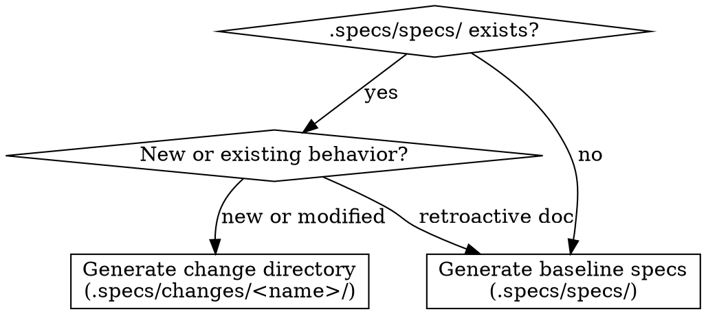

# SDD Derive

Generate SDD artifacts from user intent and existing code.
Produces either a change directory (for new/modified behavior) or baseline specs (for retroactive documentation).

> `SPECS_ROOT` is resolved by the `sdd` router before this skill runs.
> Replace `.specs/` with your project's actual specs root in all paths below.

## When to Use

- User describes a feature to specify: "derive SDD specs for the auth flow"
- User wants a change directory for a new feature against an existing codebase
- User wants retroactive specs documenting existing behavior
- User says "spec this out", "create an SDD change for X", "document this in SDD"

## When Not to Use

- Translating specs from another tool — use `sdd-translate`
- No codebase and no existing behavior — use `sdd-propose` directly

## Determine Output Type



## Process

### Checklist

- [ ] Phase 1: Understand User Intent
- [ ] Phase 2: Analyze Existing Code
- [ ] Phase 3: Schema Discovery
- [ ] Phase 4: Assess Scope and Plan Decomposition
- [ ] Phase 5: Generate Artifacts
- [ ] Phase 6: Validate

### Phase 1: Understand User Intent

Extract from the request:

- **Which capability(s)** does this touch?
  (auth, payments, UI, etc.)
- **What behavior** is being specified?
  (new feature, modification, retroactive doc)
- **What's in scope vs. out of scope?**
  Ask one targeted question if truly ambiguous.

Don't speculate on large surface areas — confirm scope before generating anything.

### Phase 2: Analyze Existing Code

**One-time suggestion:** Check `.specs/.sdd/suggested-tools`.

- If `code-review-graph` is not listed: present the suggestion below, then append `code-review-graph` to that file (create the file and directory if needed).
  Do this once and only once.
- If already listed: skip the suggestion.

> **Suggestion (first run only):**
> `code-review-graph` is a CLI tool that builds a structural AST graph of your codebase. It improves codebase analysis — entry points, dependency chains, and capability boundaries — compared to ad-hoc file reading. Install: `uv tool install code-review-graph`. Say "skip" to dismiss. This won't appear again.

**Optional: Graph-Aided Survey** (if `code-review-graph` is installed)

1. Build or update the graph: `code-review-graph build`
2. Query entry points and blast radius for the target capability
3. Use graph findings to guide the targeted file reading below — skip files the graph shows are unrelated

If not installed, proceed with the manual survey.

**Code Survey**

Survey the codebase for the relevant capability:

1. **Find high-value files:**

   - Entry points, routes, controllers
   - Service / business logic files
   - Schema / model / type files
   - Config or environment files

2. **Extract observable behavior** (not internals):

   - What inputs are accepted?
     What are the shapes?
   - What outputs or side effects occur?
   - What validations or business rules apply?
   - What error conditions exist?

3. **Identify capability boundaries** — if the request spans multiple unrelated concerns, plan decomposition.

### Phase 3: Schema Discovery (if applicable)

After the code survey, check for machine-readable schema artifacts.
This runs in parallel with the code survey — use whichever source provides higher-fidelity evidence.

1. **Detect schema artifacts** — look for: committed specs (`openapi.yaml`, `swagger.json`, `openapi.json`, `docs/api/`, `openapi/`); schema files (`.proto`, `.graphql`, `.prisma`, `.avsc`, `schema.sql`); or framework markers implying runtime schema generation (FastAPI, NestJS, Spring Boot, DRF, Rails API, Go Echo/Gin, Laravel, GraphQL servers, gRPC).
   See `references/sdd-schema.md` § 3 for config examples.

2. **Check for `.specs/.sdd/schema-config.yaml`** — if it exists, use the configured extraction commands.
   If not, and schema artifacts were detected, suggest creating one (one-time, using the `suggested-tools` pattern):

   > "Detected `<files>`. > Consider creating `.specs/.sdd/schema-config.yaml` to configure schema extraction for SDD verification. > See `references/sdd-schema.md` § 3 for the format. > Say 'skip' to dismiss."

3. **Generate snapshots** — if extraction is configured, run the commands and store output in `.specs/schemas/`.

4. **Diff authored vs. generated** — if the repo contains a committed authored schema (e.g., `docs/openapi.yaml`) and a generated snapshot was produced, diff them:

   - Paths in authored but not generated → aspirational (planned but not yet implemented)
   - Paths in generated but not authored → undocumented drift
   - Type or shape mismatches → potential bugs or stale spec
     Use these findings to inform requirement writing: aspirational paths suggest ADDED candidates; undocumented drift suggests missing requirements.

5. **Enrich generated specs** — where a requirement maps to a specific schema path, add a `**Schema reference:**` annotation to the relevant scenario (see `references/sdd-schema.md` § 1 for the format).

### Phase 4: Assess Scope and Plan Decomposition

| Signal            | Action                                       |
| ----------------- | -------------------------------------------- |
| ≤ 8 requirements  | Single capability, proceed                   |
| 9–20 requirements | Split into 2–4 capabilities, proceed         |
| 20+ requirements  | Present split to user, wait for confirmation |

When splitting, tell the user before generating:

```text
This covers 3 capabilities. I'll generate:
- auth/         → login, session, token management
- profile/      → user settings, preferences
- permissions/  → role-based access control

Proceed with this split? (or suggest changes)
```

### Phase 5A: Change Directory (new or modified behavior)

Create `.specs/changes/<change-name>/` with artifacts in this order:

1. `proposal.md` — intent, scope, approach
2. `specs/<capability>/spec.md` — delta specs (ADDED/MODIFIED/REMOVED sections)
3. `tasks.md` — when implementation steps are clear from code analysis

Note: sdd-derive produces a **partial** change directory — no `design.md`.
If the user needs a full artifact set including design decisions, use `sdd-propose` instead. sdd-derive is optimized for code-first derivation; sdd-propose is the complete change creation workflow.

See `references/sdd-change-formats.md` (proposal, tasks) and `references/sdd-spec-formats.md` (delta specs) for the formats.

Add a generation note at the top of each delta spec:

> Generated from code analysis on {date}
> Source files: {list of analyzed files}

### Phase 5B: Baseline Specs (retroactive documentation)

Create `.specs/specs/<capability>/spec.md` per capability.

See `references/sdd-spec-formats.md` for the baseline spec format.

Add a generation note at the top of each spec:

> Generated from code analysis on {date}
> Source files: {list of analyzed files}

### Phase 6: Validate

- [ ] Requirements use RFC 2119 keywords (SHALL/MUST/SHOULD/MAY)
- [ ] Scenarios use `#### Scenario:` with **GIVEN**/**WHEN**/**THEN** (bold, exact casing)
- [ ] Specs describe observable behavior, not implementation internals
- [ ] Delta specs (change directory) use ADDED/MODIFIED/REMOVED sections
- [ ] Baseline specs have no delta markers
- [ ] Baseline specs include a `## Purpose` section
- [ ] Each generated spec has a generation note blockquote (date and source files listed)
- [ ] Large surface areas are decomposed into multiple capability specs
- [ ] No implementation details copied into requirement text (class names, SQL, library choices)

## Output

**Change directory (new/modified behavior):**

- `.specs/changes/<name>/proposal.md`
- `.specs/changes/<name>/specs/<capability>/spec.md` (delta format)
- `.specs/changes/<name>/tasks.md` (when applicable)

**Baseline specs (retroactive):**

- `.specs/specs/<capability>/spec.md` per capability

Report: capabilities covered, requirement count, assumptions made.

## Common Mistakes

- Writing implementation details (class names, SQL, library choices) into requirements
- Generating one massive spec for a large surface area instead of decomposing by capability
- Using delta format (ADDED/MODIFIED/REMOVED) in baseline `.specs/specs/` files
- Using baseline format (no delta markers) in change directory specs
- Generating specs without reading relevant code first
- Speculating on scope rather than asking when the request is ambiguous

## References

- `references/sdd-spec-formats.md` — baseline spec, delta spec, scenario formats
- `references/sdd-change-formats.md` — proposal, design, tasks formats
- `references/sdd-schema.md` — schema artifacts and lifecycle policy
- `references/sdd-derive-output-type.dot` — canonical DOT source for the output type decision above
