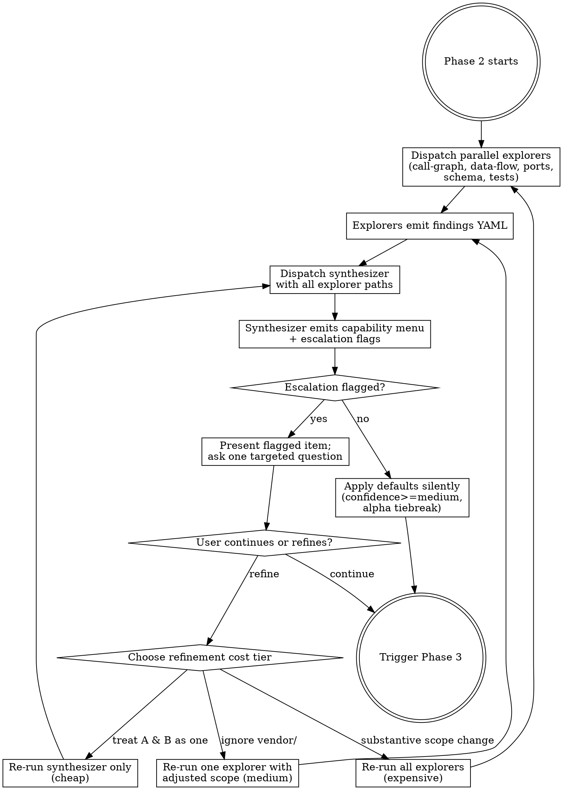

# Discovery Phase

Discovery is a phase, not a single subagent.
The orchestrator makes two sequential calls:

1. **`discovery-explore`** — fan out parallel explorers, each running a methodologically distinct technique.
2. **`discovery-synthesize`** — single synthesizer reconciles all explorer outputs into a capability menu.

The orchestrator then presents the menu for Pre-flight Consent (SKILL.md Phase 3).

## Why parallel explorers + synthesizer

Different techniques surface different signals:

- Call graph misses state coupling.
- AST misses runtime DI.
- Schema artifacts miss undocumented behavior.

Fan-out gives each technique its own context budget.
The synthesizer reconciles; it does not explore.

The discriminator is **methodological distinctness**: each explorer must use a different _technique_, not just a different label.

## Explorer set

Default explorers (extensible):

| Explorer          | Technique                                                                                | When to run                                         |
| ----------------- | ---------------------------------------------------------------------------------------- | --------------------------------------------------- |
| `call-graph`      | `code-review-graph` (preferred) or naive AST traversal                                   | Always (graph if available, AST fallback)           |
| `data-flow`       | String-literal scanning for table names, queue names, topic names, file paths, env keys  | Always                                              |
| `port-interface`  | Framework-aware extraction of interface declarations, DI registrations, route decorators | Always (framework heuristics applied conditionally) |
| `schema-artifact` | Detect and parse OpenAPI, GraphQL, Protobuf, SQL schemas                                 | Conditional on artifact presence                    |
| `test-suite`      | Identify test files, link to capability scope via filename and import patterns           | Conditional on test directory presence              |

Each explorer reports `status: ran | not_applicable | failed` with a one-line `status_reason` when not run.

## Per-explorer instructions

### `call-graph`

Prefer `code-review-graph` (CLI tool building structural AST graph with communities, bridges, hubs, impact radius).
Fall back to naive AST traversal only if unavailable.

**With `code-review-graph`:**

1. Build/update graph: `code-review-graph build`.
2. Query communities, hub nodes, and bridges in regions matching user intent.
3. Query impact radius from entry points to detect cross-region blast.
4. Drive `references` from graph findings (hub objects, community members, bridge nodes).
5. Skip files the graph shows are unrelated.

**AST fallback:**

1. Walk imports and call edges from likely entry points (`main`, route handlers, CLI entries, test fixtures).
2. Cluster files by import locality + filename heuristics.
3. Mark `confidence: medium` or `low` on heuristic-only candidates.
4. Surface a `gotcha` for language-coverage gaps.

Fallback findings are strictly less rich; the synthesizer weights accordingly.

### `data-flow`

Catches cross-capability state coupling that the call graph misses.
Primary defense against the "call graph misses shared writes to the same DB row" failure mode.

1. Extract string literals: SQL table/column names, queue/topic names, file paths, env vars, cache keys, config paths.
2. Group by literal — sites sharing a literal across capability candidates are _synthetic bridges_.
3. Emit `kind: overlap` with `kind: state` for each synthetic bridge (distinct from call-graph `kind: call`).
4. Emit `kind: external_surface_candidate` for literals matching known external system patterns.

### `port-interface`

Framework-aware extraction of interface declarations and registrations.

1. Detect framework patterns (Spring `@Module`/`@Component`, NestJS controllers/providers, FastAPI route decorators, Rails controllers, Django views, gRPC service definitions).
2. Extract declared interfaces, ports, and DI bindings.
3. Emit `kind: capability_candidate` based on interface boundaries.
4. Emit `kind: external_surface_candidate` for declared public APIs (HTTP routes, gRPC methods, CLI commands, library exports).
5. Skip framework steps for frameworks not detected.

When call-graph and port-interface disagree on boundaries, the synthesizer surfaces an `axis_disagreement` rather than picking.

### `schema-artifact`

Canonical home for schema discovery.
Runs the snapshot lifecycle.

**1.**
**Detect artifacts.**
Look for committed specs (`openapi.yaml`, `swagger.json`, `docs/api/`, `openapi/`), schema files (`.proto`, `.graphql`, `.prisma`, `.avsc`, `schema.sql`, migrations), or framework markers implying runtime schema generation (FastAPI, NestJS, Spring Boot, DRF, Rails API, Echo/Gin, Laravel, GraphQL, gRPC).
If none, report `status: not_applicable`.

**2.**
**Check `.specs/.sdd/schema-config.yaml`.**
If present, use configured extraction commands.
If absent and artifacts were detected, emit a `kind: anomaly` finding so the orchestrator can prompt for one (one-time suggestion, see SKILL.md).
Don't block; proceed with detection-only.
See `sdd-schema.md` for config format.

**3.**
**Generate snapshots** (when extraction is configured).
Run configured commands, store output in `.specs/schemas/`.

**4.**
**Diff authored vs generated.**
When both exist:

- Authored ∖ generated → **aspirational** → `kind: capability_candidate`, `confidence: low`, signal `aspirational_only`.
- Generated ∖ authored → **undocumented drift** → `kind: anomaly`, signal `undocumented_drift`.
- Type/shape mismatches → `kind: anomaly`, signal `schema_mismatch`.

**5.**
**Surface schema-anchored findings.**
For each schema path mapping to a capability candidate, include the path in `signals` (e.g., `signals: [schema_path:/users/{id}]`).
The lifter uses these for `**Schema reference:**` annotations — see `lifter.md`.

### `test-suite`

Corroborates other explorers; rarely emits standalone candidates.

1. Detect test directories (`tests/`, `__tests__/`, `*_test.go`, `*.spec.ts`, etc.).
2. Match test files to candidates via filename, import patterns, fixtures.
3. Emit findings as `kind: capability_candidate` evidence — test files appear in `references` with `relationship: test`.
4. Weight tests asserting specific behaviors higher than tests that only exercise the code path.

## Explorer output schema

A finding is one cohesive observation ("there's a search capability here," "algorithmic region in `ranker.py`").
One explorer typically emits multiple findings of mixed kinds.

```yaml
explorer: <name>
status: ran | not_applicable | failed
status_reason: <one-line, only when not ran>
findings:
  - kind: capability_candidate | overlap | external_surface_candidate | 
      algorithmic_region | infrastructure | anomaly | <custom string>
    references:
      - path: <relative path>
        object: <optional — class, function, class.method>
        lines: [<start>, <end>]    # optional
        relationship: primary_implementation | entry_point | caller | callee | 
          consumer | producer | test | config | schema | bridge | <custom>
        rationale: <optional, brief — why this specific reference>
    rationale: <required, brief — overall reasoning>
    signals: [<explorer-specific signal names>]
    confidence: high | medium | low
```

### Field rules

- **`kind`** — use canonical values; emit custom strings only when something genuinely novel surfaces.
  Synthesizer treats unknown kinds as `anomaly`-class but preserves the original label.
- **`references`** — file-level alone is fine; object-level preferred when available.
- **`relationship`** — the reference's role in _this finding_; custom values allowed.
- **Capability naming** — do NOT commit to capability names.
  The synthesizer assigns canonical names from cross-explorer heuristics.
  Naming via the synthesizer keeps overlap detection cleaner (file/object intersection > name match).
- **`signals`** — free-form per explorer; the synthesizer reads them across findings to detect alignment.
- **`confidence`** — explorer self-assessment.
  Cross-explorer agreement count is the real confidence signal.

### Worked example

Call-graph explorer output (excerpt):

```yaml
explorer: call-graph
status: ran
findings:
  - kind: capability_candidate
    references:
      - path: src/search/service.py
        object: SearchService
        relationship: primary_implementation
      - path: src/search/scoring.py
        object: tfidf
        relationship: callee
      - path: src/api/handlers.py
        object: handle_search
        relationship: entry_point
    rationale: Tight community of 3 nodes with hub at SearchService; entry point
      identified.
    signals: [community_id_3, hub_density_high, modularity_score_0.42]
    confidence: high

  - kind: algorithmic_region
    references:
      - path: src/search/scoring.py
        object: tfidf
        lines: [42, 80]
        relationship: primary_implementation
        rationale: Threshold and decay constants
    rationale: TF-IDF computation with hand-tuned thresholds.
    signals: [hand_tuned_constant_count_2]
    confidence: medium
```

## Synthesizer

Consume all explorer outputs; produce the capability menu.
Tasks:

- Reconcile cross-explorer findings via reference overlap and signal co-occurrence.
- Assign canonical capability names.
- Surface axis disagreements (explorers proposed conflicting boundaries).
- Identify gotchas (god-modules, single-cluster degeneracy, missing language coverage).
- Estimate per-capability cost (file count, line count, token estimate).
- Propose primary owners for overlaps (default: most edges to bridge wins; ties alphabetical).

### Capability menu

```yaml
capability_menu:
  - name: <canonical name>
    files_in_scope:
      - <path>
    evidence_per_axis:
      call_graph: <summary>
      port_interface: <summary>
      ...
    overlaps:
      - with: <other capability>
        kind: call | state | port
        proposed_owner: <capability>
        bridge_references: [<path/object>]
    external_surfaces:
      - kind: consumed | exposed
        identifier: <e.g., "stripe.charges.create" or "POST /users">
        confidence: high | medium | low
    cost:
      file_count: <int>
      line_count: <int>
      token_estimate: <int>
    axis_disagreements:
      - description: <e.g., "graph clusters A+B together; ports separate them">
        explorers: [call-graph, port-interface]
        resolution_prompt: <suggested user question>

gotchas:
  - kind: god_module | single_cluster | language_uncovered | explorer_failed | <custom>
    description: <prose>
    affected_capabilities: [<names>]
```

Emit structured markdown matching this conceptual shape; a JSON/YAML schema is not required.

### Escalation flags

Output MUST surface conditions warranting user prompt.
The orchestrator reads these and decides whether Phase 3 escalates.

- `escalation: single_cluster_degeneracy` — call-graph found one giant community; synthesizer fell back to alternative partitioning.
  User confirms axis.
- `escalation: axis_disagreement` — explorers proposed materially different boundaries.
  User picks resolution.
- `escalation: low_confidence` — average confidence below `medium`.
  User confirms menu is usable.
- `escalation: external_surface_split` — explorer-confidence split on owned vs 3rd-party.
  User classifies.
- `escalation: cost_threshold` — capability count > 6 OR file count > 100.
  User confirms cost.

Absent any flag, the orchestrator proceeds with all defaults applied.

### Single-cluster degeneracy

When call-graph reports one giant community covering most of the codebase, do NOT silently fall back to single-pass derive.
Switch the partitioning axis:

- File-system structure (directory boundaries).
- Module/package boundaries (language-aware).
- Hub-node ego-networks (top-K hubs, each as a synthetic capability with its 1-hop neighborhood).

For polyglot codebases, refuse single-cluster fallback entirely: emit one capability per language root; treat inter-language calls as external surfaces.

Surface this as a `gotcha`.

## Loop semantics

The orchestrator presents the capability menu **only when an escalation condition fires** (see SKILL.md § Phase 3).
Otherwise it commits the synthesizer's defaults silently.

When prompted, the user may **continue** or **request refinement**.
Clarify ambiguous refinement requests before dispatching.

Refinement options, by cost:

- **Synthesizer-only re-run (cheap)** — apply new synthesis instructions to existing explorer outputs (e.g., "treat A and B as one capability").
- **Single-explorer re-run (medium)** — re-run one explorer with adjusted scope (e.g., "ignore `vendor/`").
- **Full re-explore (expensive)** — re-run all explorers; for substantive scope changes.

Confirm the chosen refinement type before dispatching.



## Pre-flight cost accounting

Total dispatches for a typical run:

```text
N explorers + 1 synthesizer + 2 × selected_capabilities
```

The orchestrator surfaces this in Pre-flight Consent when capability count > 3 OR file count > 50.
