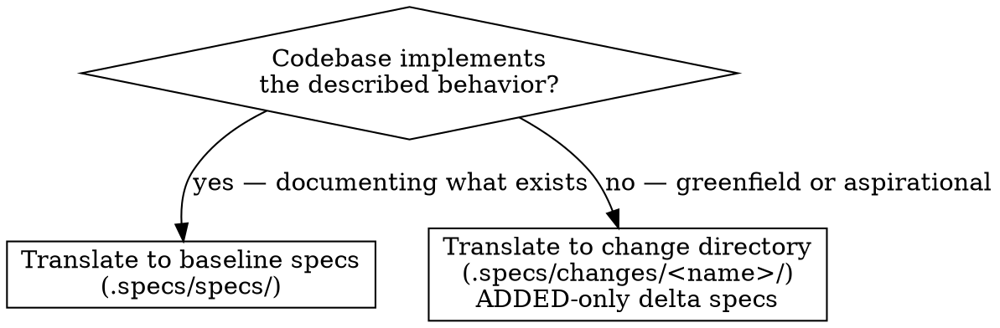

# SDD Translate

Convert existing specifications from other frameworks, tools, or formats into SDD spec files.

> `SPECS_ROOT` is resolved by the `sdd` router before this skill runs.
> Replace `.specs/` with your project's actual specs root in all paths below.

## Invocation Notice

- Inform the user when this skill is being invoked by name: `sdd-translate`.

## When to Use

- Migrating from Spec Kit, Kiro, ADRs, Jira, Confluence, or similar
- Converting structured requirements documents into SDD format
- Reverse-engineering third-party spec output into SDD specs

## When Not to Use

- No existing specs to translate — use `sdd-derive` instead
- Already in SDD format — run `sdd-verify` to check completeness

## Determine Output Type

Baseline specs (`.specs/specs/`) document **implemented** behavior.
Translated specs should only go to baseline when the codebase already implements the described behavior.



**How to check:** After inventorying source specs (Phase 1), survey the codebase for relevant implementation.
If the capabilities described in the source specs have no corresponding code, the translated specs are aspirational — generate a change directory with ADDED-only delta specs, a `proposal.md`, and optionally a `tasks.md`.
If the codebase already implements the described behavior, translate directly to baseline.

## Process

### Phase 1: Inventory Source Specs

1. **Identify source format and structure:**

   - Spec Kit → `spec.md` + `plan.md` with Markdown headings
   - Kiro → steering docs + requirements files
   - ADRs → architecture decision records (context/decision/consequences)
   - Jira/Linear → issue descriptions + acceptance criteria
   - Prose documents → natural language requirements

2. **Read all source files** before generating anything.

3. **Group into capabilities** — logical groupings that will each become one `.specs/specs/<capability>/spec.md`:

   - By feature area: `auth/`, `payments/`, `notifications/`
   - By component: `api/`, `frontend/`, `workers/`
   - By bounded context: `ordering/`, `fulfillment/`

### Phase 2: Assess Scope and Plan Decomposition

Before generating specs, count requirements across all source material:

| Signal                 | Action                                                  |
| ---------------------- | ------------------------------------------------------- |
| ≤ 8 requirements total | Single capability, proceed directly                     |
| 9–20 requirements      | Split into 2–4 capabilities, proceed                    |
| 20+ requirements       | Present capability split to user, wait for confirmation |

When decomposing, present the proposed split:

```text
Proposed capabilities:
- auth/      → login, session, token management (5 reqs)
- payments/  → billing, subscriptions (6 reqs)
- ui/        → themes, layout (4 reqs)

Proceed with this split? (or suggest changes)
```

### Phase 3: Translate Each Capability

**Output path depends on the output type decision above:**

- **Baseline** (code exists): produce `.specs/specs/<capability>/spec.md` following SDD baseline format.
- **Change directory** (greenfield/aspirational): create `.specs/changes/<name>/` with:
  - `proposal.md` — intent, scope, approach (see `references/sdd-change-formats.md`)
  - `specs/<capability>/spec.md` — ADDED-only delta specs
  - `tasks.md` — when implementation steps are clear (optional)

See `references/sdd-spec-formats.md` for both baseline and delta spec formats.

Add a source attribution blockquote at the top of each generated spec (see format reference Section 2):

> Translated from {source tool/format} on {date}
> Source: {source file or description}

**Translation rules:**

| Source pattern                                 | SDD translation                                                       |
| ---------------------------------------------- | --------------------------------------------------------------------- |
| "Users can X"                                  | `The system SHALL allow users to X`                                   |
| Acceptance criteria bullets                    | `#### Scenario:` entries with GIVEN/WHEN/THEN                         |
| "It should Y"                                  | `The system SHOULD Y`                                                 |
| "Required: Z"                                  | `The system MUST Z`                                                   |
| Implementation detail (class names, libraries) | Move to `## Technical Notes` or omit                                  |
| Phase-gated steps (plan.md, tasks.md)          | Omit — not behavior                                                   |
| "As a user, I want X so that Y"                | `The system SHALL allow users to X` (discard the "so that" rationale) |
| "Shall not / Must not"                         | `The system SHALL NOT / MUST NOT {prohibited behavior}`               |
| Numbered requirement IDs (e.g., `REQ-001:`)    | Strip the ID prefix; preserve the requirement text                    |

**Critical rules:**

- Requirements describe WHAT, not HOW
- Every scenario must have **GIVEN**, **WHEN**, **THEN** (bold labels, exact casing)
- Scenarios use `####` (4 hashtags), requirements use `###` (3 hashtags)
- **Baseline output:** no delta markers (ADDED/MODIFIED/REMOVED)
- **Change directory output:** use ADDED sections only (all behavior is new); no `## Purpose` or `## Technical Notes`

### Phase 4: Validate Output

**Common to both output types:**

- [ ] Every `### Requirement:` uses RFC 2119 keywords (SHALL/MUST/SHOULD/MAY)
- [ ] Every scenario uses **GIVEN**/**WHEN**/**THEN** with bold labels
- [ ] No implementation details in requirements (class names, SQL, library choices)
- [ ] Scenarios use `####` heading level (not `###` or `#####`)
- [ ] Implementation details from source were moved to `## Technical Notes` (baseline) or omitted (change directory)

**Baseline output only:**

- [ ] `## Purpose` section present in each spec
- [ ] No delta markers (ADDED/MODIFIED/REMOVED)

**Change directory output only:**

- [ ] All specs use ADDED sections only (delta format)
- [ ] `proposal.md` exists with Intent, Scope, Approach
- [ ] No `## Purpose` or `## Technical Notes` in delta specs

### Phase 5: Schema Snapshot (if schemas configured)

If `.specs/.sdd/schema-config.yaml` exists:

1. Generate schema snapshots using the configured extraction commands.
2. Store in `.specs/schemas/` — this establishes the baseline for all future `sdd-verify` conformance checks.
3. Update `.specs/schemas/.schema-sources.yaml` with the generation date.

If no schema config exists but schema artifacts are detected in the repo (e.g., `openapi.yaml`, `.proto` files, `schema.graphql`), suggest creating `.specs/.sdd/schema-config.yaml` before the first `sdd-verify` run:

> "Detected schema artifacts. A `.specs/.sdd/schema-config.yaml` would let `sdd-verify` cross-validate implementation against these specs. See `references/sdd-schema.md` § 3 for the format. Say 'skip' to dismiss."

If no schema config and no artifacts detected, skip silently.

## Output

**Baseline (code exists):**

- `.specs/specs/<capability>/spec.md` per capability

**Change directory (greenfield/aspirational):**

- `.specs/changes/<name>/proposal.md`
- `.specs/changes/<name>/specs/<capability>/spec.md` (ADDED-only delta format)
- `.specs/changes/<name>/tasks.md` (when applicable)

Summary: capabilities created, requirement count per capability, translation notes and assumptions.

## Common Mistakes

- Copying implementation detail from source files into requirements
- Using non-RFC-2119 language ("the system will", "users can") instead of SHALL/MUST/SHOULD
- One giant spec instead of capability decomposition for large surface areas
- Including delta markers (ADDED/MODIFIED) in baseline specs
- Not reading all source files before generating output
- Writing baseline specs for a greenfield project — `.specs/specs/` asserts implemented behavior; if nothing is built yet, use a change directory with ADDED-only delta specs

## References

- `references/sdd-spec-formats.md` — baseline spec and scenario formats
- `references/sdd-schema.md` — schema config format and lifecycle policy
