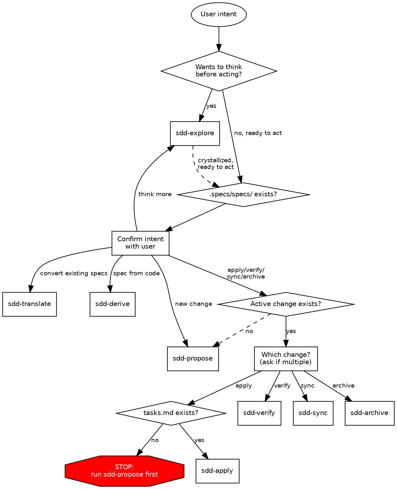

# SDD — Spec Driven Development

Route user intent to the correct `sdd-*` child skill.
Classify first, then confirm with the user before routing.

## Invocation Notice

When this skill is invoked, announce: "Using **sdd** to route your spec-driven development request."

## Trigger Tests

Should trigger:

- "Spec this feature out"
- "I want to create a change proposal"
- "Apply the tasks in my change"
- "Verify that I implemented everything correctly"
- "Sync the delta specs into main"
- "Archive the auth-refactor change"
- "I want to think through this before speccing it"

Should not trigger:

- "Write a commit message"
- "Debug this Python error"
- "Review my PR"

## Route by Intent

| User Intent                              | Route           | Notes                  |
| ---------------------------------------- | --------------- | ---------------------- |
| Think before acting, explore ideas       | `sdd-explore`   | Always available       |
| Convert existing specs from another tool | `sdd-translate` | Bootstrap path         |
| Generate specs from codebase analysis    | `sdd-derive`    | Bootstrap or change    |
| Create a change with all artifacts       | `sdd-propose`   | Change path            |
| Implement tasks from tasks.md            | `sdd-apply`     | Requires tasks.md      |
| Verify implementation matches specs      | `sdd-verify`    | Requires active change |
| Merge delta specs into main specs        | `sdd-sync`      | Requires delta specs   |
| Complete and archive a change            | `sdd-archive`   | Requires active change |

## Routing Flowchart



## Routing Rules

1. **Classify intent first** — explore-or-act, then determine path
2. **Infer mode from directory state** — check `.specs/specs/` existence — but **always confirm with user** before routing
3. **One hard gate** — `sdd-apply` requires `tasks.md` at `.specs/changes/<change-name>/tasks.md`; if missing, stop and route to `sdd-propose`
4. **Prefer minimal next step** — don't run the full pipeline unless requested
5. **Explore is mode-agnostic** — available at every stage, before or after any action
6. **Multiple active changes** — ask which change before routing to apply/verify/sync/archive

## Sequence Gates

| Action      | Expected prerequisite              | Warning if missing                                               |
| ----------- | ---------------------------------- | ---------------------------------------------------------------- |
| sdd-apply   | `tasks.md`                         | **Hard block** — "No tasks to implement. Run sdd-propose first." |
| sdd-verify  | Some completed tasks in `tasks.md` | "No completed tasks yet — verify output will be limited."        |
| sdd-sync    | Delta specs in change directory    | "No delta specs to sync."                                        |
| sdd-archive | All tasks complete                 | "Incomplete tasks remain. Archive anyway?" (ask user)            |
| design.md   | `proposal.md` exists               | "Consider writing a proposal first for context."                 |

## Directory Convention

All SDD skills operate on `.specs/` at the project root:

```text
.specs/
├── specs/                          # Main specs (source of truth)
│   └── <capability>/
│       └── spec.md
├── changes/
│   ├── <change-name>/              # In-progress changes (kebab-case)
│   │   ├── proposal.md
│   │   ├── design.md
│   │   ├── tasks.md
│   │   └── specs/                  # Delta specs
│   │       └── <capability>/
│   │           └── spec.md
│   └── archive/                    # Completed changes
│       └── YYYY-MM-DD-<name>/
└── .sdd/                           # SDD tooling metadata (not specs)
    └── suggested-tools            # Tracks one-time tool suggestions
```

An **active change** is any directory directly under `.specs/changes/` (not under `archive/`).
Archived changes live in `.specs/changes/archive/YYYY-MM-DD-<name>/`.

## References

- `references/sdd-formats.md` — artifact format reference (baseline, delta, proposal, design, tasks)
- `references/sdd-router.dot` — canonical DOT source for the routing flowchart above
