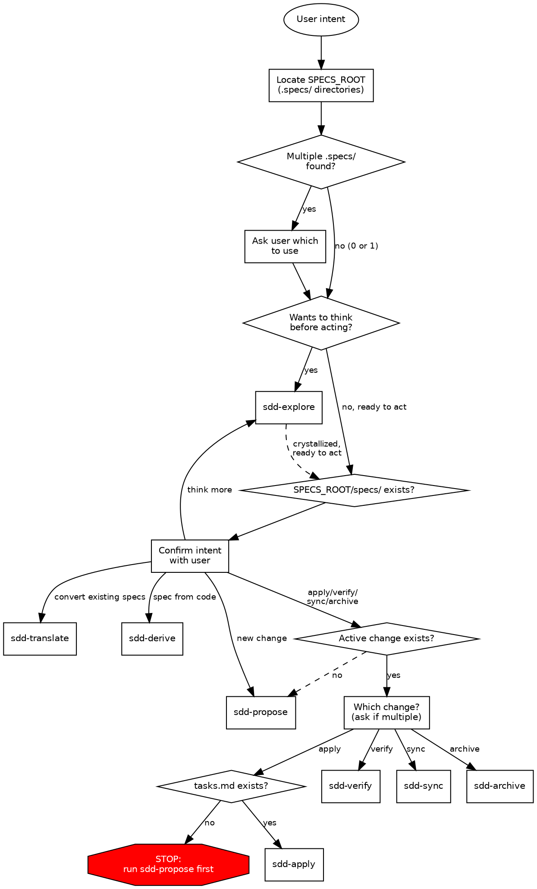

# SDD — Spec Driven Development

Route user intent to the correct `sdd-*` child skill.
Classify first, then confirm with the user before routing.

## Invocation Notice

When this skill is invoked, announce: "Using **sdd** to route your spec-driven development request."

## Trigger Tests

Should trigger:

- "Spec this feature out"
- "I want to create a change proposal"
- "Apply the tasks in my change"
- "Verify that I implemented everything correctly"
- "Sync the delta specs into main"
- "Archive the auth-refactor change"

Should not trigger:

- "Help me brainstorm"
- "Write a commit message"
- "Debug this Python error"
- "Review my PR"

## Locate Specs Root

Before routing, run the discovery script and parse its JSON:

```sh
skills/sdd/scripts/find-specs-roots.py [--explicit PATH]
```

Pass `--explicit PATH` only if the user named a specific directory.
The script anchors at the repo root (or cwd when not in a git repo), discovers `.specs/` candidates, analyzes any `SPECS_ROOT` pointer files, and falls back to `specs/` discovery if no `.specs/` is found.

The agent — not the script — drives the user-facing dialogue.
See `references/find-specs-roots.md` for the **output schema, decision branches, and `SPECS_ROOT` pointer-file format**.

Summary of behavior:

- Multiple `.specs/` candidates → ask which to use.
- Single `.specs/` with a valid pointer → follow it once; surface any malformed/broken/out-of-workspace pointer instead of silently falling back.
- No `.specs/` but `specs/` fallback hits → confirm with user (default: parent of `specs/`).
- Nothing found → ask where to initialize.
- Always announce the resolved path; if a pointer was followed, announce both marker and target.

Call the resolved path `SPECS_ROOT`.
All child skills use `SPECS_ROOT` in place of `.specs/`.

## Route by Intent

| User Intent                              | Route           | Notes                  |
| ---------------------------------------- | --------------- | ---------------------- |
| Think before acting, explore ideas       | `sdd-explore`   | Always available       |
| Convert existing specs from another tool | `sdd-translate` | Bootstrap path         |
| Generate specs from codebase analysis    | `sdd-derive`    | Bootstrap or change    |
| Create a change with all artifacts       | `sdd-propose`   | Change path            |
| Implement tasks from tasks.md            | `sdd-apply`     | Requires tasks.md      |
| Verify implementation matches specs      | `sdd-verify`    | Requires active change |
| Merge delta specs into main specs        | `sdd-sync`      | Requires delta specs   |
| Complete and archive a change            | `sdd-archive`   | Requires active change |

## Routing Flowchart

> The chart focuses on intent routing. Discovery details (the `specs/` fallback and `SPECS_ROOT` pointer-file redirect) are described in **Locate Specs Root** above and elided here for readability.



## Routing Rules

1. **Resolve SPECS_ROOT first** — locate `.specs/` before routing; ask if multiple exist or user specifies a path
2. **Classify intent** — explore-or-act, then determine path
3. **Infer mode from directory state** — check `SPECS_ROOT/specs/` existence — but **always confirm with user** before routing
4. **One hard gate** — `sdd-apply` requires `tasks.md` at `SPECS_ROOT/changes/<change-name>/tasks.md`; if missing, stop and route to `sdd-propose`
5. **Prefer minimal next step** — don't run the full pipeline unless requested
6. **Explore is mode-agnostic** — available at every stage, before or after any action
7. **Multiple active changes** — ask which change before routing to apply/verify/sync/archive

## Sequence Gates

| Action      | Expected prerequisite                | Warning if missing                                               |
| ----------- | ------------------------------------ | ---------------------------------------------------------------- |
| sdd-apply   | `SPECS_ROOT/changes/<name>/tasks.md` | **Hard block** — "No tasks to implement. Run sdd-propose first." |
| sdd-verify  | Some completed tasks in `tasks.md`   | "No completed tasks yet — verify output will be limited."        |
| sdd-sync    | Delta specs in change directory      | "No delta specs to sync."                                        |
| sdd-archive | All tasks complete                   | "Incomplete tasks remain. Archive anyway?" (ask user)            |
| design.md   | `proposal.md` exists                 | "Consider writing a proposal first for context."                 |

## Directory Convention

All SDD skills operate on `SPECS_ROOT` — resolved at session start (see **Locate Specs Root** above).
The default is `.specs/` at the project root, but monorepos or user preference may place it elsewhere (e.g., `packages/api/.specs/`, `services/auth/.specs/`).

Child skills replace `.specs/` with `SPECS_ROOT` in all paths.

```text
<SPECS_ROOT>/          # e.g. .specs/ or packages/api/.specs/
├── specs/                          # Main specs (source of truth)
│   └── <capability>/
│       └── spec.md
├── schemas/                        # Schema snapshots (generated from code)
│   ├── .schema-sources.yaml        # Manifest: generation date and source per schema
│   └── <schema-type>               # e.g., openapi.yaml, db-schema.sql, schema.graphql
├── changes/
│   ├── <change-name>/              # In-progress changes (kebab-case)
│   │   ├── proposal.md
│   │   ├── design.md
│   │   ├── tasks.md
│   │   ├── schemas/                # Schema snapshots scoped to this change
│   │   │   ├── before/             # Snapshot taken at propose/derive time
│   │   │   ├── after/              # Snapshot taken at verify time
│   │   │   └── expected.md         # Prose: expected schema changes
│   │   └── specs/                  # Delta specs
│   │       └── <capability>/
│   │           └── spec.md
│   └── archive/                    # Completed changes (schemas travel with change)
│       └── YYYY-MM-DD-<name>/
├── .sdd/                           # SDD tooling metadata
│   ├── schema-config.yaml          # Project schema extraction config
│   └── suggested-tools             # Tracks one-time tool suggestions
```

An **active change** is any directory directly under `SPECS_ROOT/changes/` (not under `archive/`).
Archived changes live in `SPECS_ROOT/changes/archive/YYYY-MM-DD-<name>/`.
Schema snapshots travel with the change directory into the archive — no separate schema archive path is needed.

## References

- `references/sdd-spec-formats.md` — baseline spec, delta spec, scenario formats
- `references/sdd-change-formats.md` — proposal, design, tasks formats
- `references/sdd-schema.md` — schema artifacts and lifecycle policy
- `references/sdd-router.dot` — canonical DOT source for the routing flowchart above
- `references/find-specs-roots.md` — output schema for the discovery script used in **Locate Specs Root**
- `scripts/find-specs-roots.py` — discovery script that resolves `.specs/`, fallback `specs/`, and `SPECS_ROOT` pointer files
