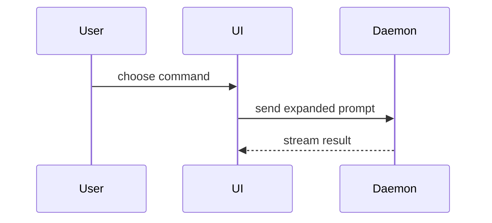

# Show Me

> A picture is worth 1000 words.

Help the user envision the current topic.
The visual is the answer: skip the preamble, keep prose brief, and pick the smallest view that makes the key point clear.

## Invocation Notice

- Tell the user when this skill is running: `show-me`.
  Skip the notice when the user asked for the skill by name or slash command; spelling and spacing need not match.
  A phrase from this skill's own trigger list is not a name — naming the work is not naming the skill.

## The Palette

- Show logic or an algorithm as pseudocode:

```text
on(save)
  if content is unchanged
    return cached result
  write new content
  return fresh result
```

- Show runtime control flow as a call tree:

```text
submitForm
  createSession
    persistPrompt
    launchAgent
  navigateToSession
```

- Show UI structure as a component tree, including state and module boundaries that matter:

```tsx
<SessionPage> (apps/example/src/routes/session.tsx)
  useSessionEvents()
  <SessionToolbar>
    <RunSkillButton> (packages/ui)
```

- Show file responsibility or a broad refactor as a shallow file tree:

```text
src/
├── commands/       # parses user actions
├── sessions/       # owns session state
└── transport/      # sends API requests
```

- Show component interaction, control flow, or data flow with Mermaid:



- Use `diff` when the point is what changes and the surrounding shape already exists.
  Diff the sketch, not the source — match the diff shape to the topic.

For a component change:

```diff
 <SessionPage>
   useSessionEvents()
   <SessionToolbar>
+    <RunSkillButton />
   <SessionTimeline>
+    <SkillResultCard />
```

For a file-layout change:

```diff
 src/
 ├── commands/
+│   └── show-me.ts       # expands the slash command
 ├── sessions/
-└── transport.ts
+└── transport/
+    ├── client.ts
+    └── stream.ts
```

For a call-tree or call-stack change:

```diff
 submitForm
   createSession
     persistPrompt
+    expandSkillMention
     launchAgent
-  navigateToSession
+  navigateToSession
+    subscribeToEvents
```

For a state or control-flow change:

```diff
 on(save)
-  write content
+  if content is unchanged
+    return cached result
+  write new content
+  invalidate cache
```

- Show the whole block when most of it is new, when omitted context would hide ownership or order, or when the user needs a copyable target shape:

```ts
function expandSkill(command: string): string {
  const skillName = command.slice(1)
  return `use the ${skillName} skill`
}
```

- For a visual UI, a layout, a state comparison, or a concept too dense for Mermaid, write one focused HTML file — a diagram, an infographic, or a short slide deck, whichever fits the point.
  Match the product's colors, type, spacing, and components; use real labels and data; support desktop and mobile.
  Then open it for the user (`open path/to/show-me-<slug>.html`).

- Show a pattern in data as a chart, in one focused HTML file.
  Use the lightest rendering that makes the pattern visible: inline SVG for a small static look; Plotly (CDN) when hover, zoom, or panning justifies the dependency; d3 only when the encoding is genuinely custom.
  Plot the user's real data, not placeholders.
  If the user keeps the file, inline the data and prefer the dependency-free rendering so it works offline.
  This is a look at the data in front of the user, not an analysis service — no dashboards, no metric pipelines.

## Guidance

Place each visual next to the short text it supports.
Keep only the calls, files, props, states, and boundaries needed to answer the user's current question or the options that resolve the current discussion point.

Use one of these views or combine a few; almost never all of them.
Use your judgment and don't overwhelm the user.

## Persistence

Sketches are ephemeral by default — they live in the conversation, and that is usually right.
Do not ask upfront whether to save.
When the user wants to keep a visual, save it where they choose; date HTML filenames `YYYY-MM-DD-show-me-<slug>.html` so a directory of them time-sorts.

## Mermaid Tooling (optional)

A fenced Mermaid block is the deliverable in most cases, and it needs no tooling at all.
Reach for these two scripts only when the diagram must be checked before the user sees it, or when they asked for an image file:

- `scripts/validate_mermaid.py` — confirm the Mermaid parses.
  Reads stdin or `--input`, and exits non-zero with the parser's message.
- `scripts/render_mermaid.py` — write the diagram to `--output`, format taken from the extension (`.svg`, `.png`, `.pdf`).
  Prefer SVG for Markdown embedding.

Both run on `uv` alone and render locally — no Node, no browser, and nothing sent to the Mermaid web service.
Assume they work rather than checking first; the inline `uv` metadata installs what they need on first run.

If either script fails, read the message before reacting.
A parse error is a defect in the diagram — fix the Mermaid and re-run.
Any other failure means rendering is unavailable on this machine: say so plainly, offer the fenced block as-is, and pick another view from the list above rather than pressing the user to install anything.

## Interactive Browser Sessions

When a design discussion needs clickable options — the user picking between mockups, wireframes, or visual directions across several turns — a local browser session serves the visuals and records selections.
This requires the user's consent before starting (it is token-intensive and opens a local URL).
Read `references/visual-session.md` for the consent gate, server mechanics, and content templates.

## When the Ask Outgrows a Sketch

- If the user's follow-ups show they need the understanding to stick — background, sequencing, a self-check — incorporate `teach-me`: keep the visuals already on the table and build the lesson around them.
- If the thing to see is behavior — real outputs, live state, something the user should poke at and re-run rather than look at — offer `interactive-notebook-demo`: an executable walkthrough instead of a static picture.

For a quick, ephemeral ask, stay silent; offer neither.
