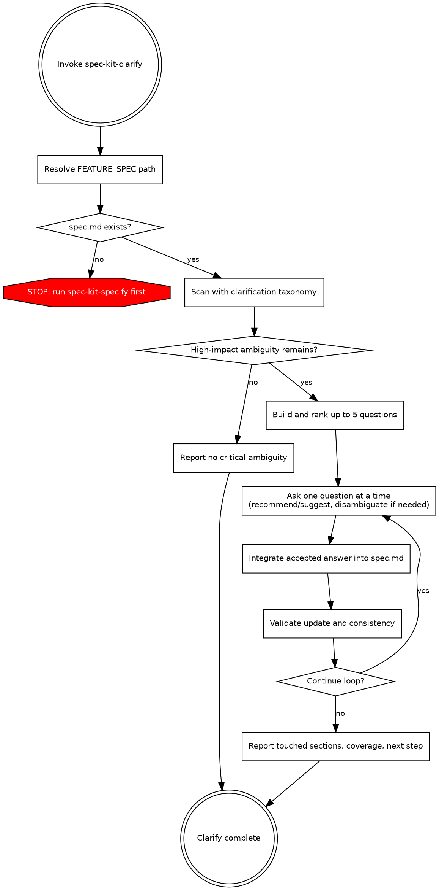

# Spec Kit Clarify

Resolve high-impact ambiguity in the active feature specification before planning.

## When to Use

- `spec.md` already exists but has high-impact uncertainty.
- You see unresolved placeholders (for example `[NEEDS CLARIFICATION]`, TODOs, or conflicting statements).
- Ambiguity could materially change architecture, data model, testing, UX behavior, operations, or compliance expectations.

## When Not to Use

- No feature spec exists yet (`spec-kit-specify` first).
- Work is design decomposition (`spec-kit-plan`) or task generation (`spec-kit-tasks`).
- You only need read-only consistency analysis (`spec-kit-analyze`).
- You are reconciling broader cross-artifact drift (`spec-kit-reconcile`).

## Router Fit

- Primary route from `spec-kit` after `spec-kit-specify` and before `spec-kit-plan` when ambiguity is still blocking.

## Key Rules

- Ask exactly one question at a time.
- Ask at most 5 accepted questions per run.
- Every question must materially influence architecture, data model, testing, UX, operations, or compliance.
- Integrate each accepted answer into `spec.md` immediately.

## Workflow

1. Resolve active spec path:

   - Run `scripts/check-prerequisites.sh --paths-only --json`.
   - Read `FEATURE_SPEC` from the JSON payload.
   - If `FEATURE_SPEC` is missing, stop and direct the user to `spec-kit-specify`.

2. Build an internal ambiguity coverage map from `spec.md`:

   - Use `assets/clarification-taxonomy.md` as the required category checklist.
   - Score each category as `Clear`, `Partial`, or `Missing`.
   - Create candidate questions only for `Partial` or `Missing` categories where clarification changes implementation or validation outcomes.

3. Prioritize up to 5 candidate questions:

   - Rank by `Impact * Uncertainty`.
   - Exclude already-answered items, stylistic preferences, and low-impact plan-level details.
   - Ensure each question is answerable by either:
     - multiple choice with 2-5 mutually exclusive options, or
     - short answer constrained to `<=5 words`.

4. Run the interactive one-question loop:

   - Follow the workflow chart above for branching and stop conditions.
   - Ask exactly one question at a time.
   - For multiple-choice questions, provide a recommendation and an options table.
   - For short-answer questions, provide a suggested answer and enforce `<=5 words`.
   - Accept `yes`, `recommended`, or `suggested` as confirmation of the current recommendation.
   - Use disambiguation follow-ups when needed without consuming a new question slot.

5. Integrate each accepted answer immediately:

   - Ensure `## Clarifications` exists.
   - Ensure a session heading exists: `### Session YYYY-MM-DD`.
   - Append: `- Q: <question> → A: <final answer>`.
   - Update the most relevant section(s) inline:
     - functional behavior,
     - user stories/actors,
     - data model,
     - non-functional metrics,
     - edge/error handling,
     - terminology normalization.
   - Replace superseded contradictory statements instead of duplicating.
   - Save `FEATURE_SPEC` after each accepted answer.

6. Validate after each write and on final pass:

   - Exactly one clarification bullet per accepted answer.
   - Accepted questions count is `<=5`.
   - No contradiction remains for resolved decisions.
   - No unresolved vague placeholder remains for resolved items.
   - Only these new headings are introduced: `## Clarifications`, `### Session YYYY-MM-DD`.
   - Canonical terminology is consistent across modified sections.

7. Report completion:

   - Questions asked and answered.
   - Updated `FEATURE_SPEC` path.
   - Sections touched.
   - Coverage summary by category with status:
     - `Resolved`
     - `Deferred`
     - `Clear`
     - `Outstanding`
   - Next-step recommendation: proceed to `spec-kit-plan` or run clarify again later.

## Behavior Rules

- If no high-impact ambiguity exists, respond: `No critical ambiguities detected worth formal clarification.` and suggest proceeding.
- Never exceed 5 accepted questions (disambiguation retries do not count as new questions).
- Respect early termination signals: `stop`, `done`, `proceed`.
- Avoid speculative tech-stack questions unless their absence blocks functional correctness.
- If quota is reached with unresolved high-impact items, mark them as `Deferred` with rationale.

## Output

- Updated `spec.md` with embedded clarification history
- Summary of asked/answered questions, touched sections, and unresolved/deferred areas

## Common Mistakes

- **Low-impact questions.**
  Never ask about cosmetic or stylistic details.
  Every question must materially affect architecture, data model, testing, UX, operations, or compliance.
- **Asking multiple questions at once.**
  Ask one question at a time.
  Batching questions overwhelms the user and produces shallow answers.
- **Not updating spec inline.**
  Each accepted answer must be applied to the relevant spec sections immediately.
  Never defer updates to a later pass.
- **Redundant clarifications.**
  Check existing spec content and prior clarification sessions before asking.
  Do not re-ask what is already resolved.

## References

- `assets/clarification-taxonomy.md`
- `references/spec-kit-workflow.dot` for overall context of how the clarification fits into the Spec Kit process.
- `scripts/check-prerequisites.sh`
- `https://github.com/github/spec-kit/blob/9111699cd27879e3e6301651a03e502ecb6dd65d/templates/commands/clarify.md`
