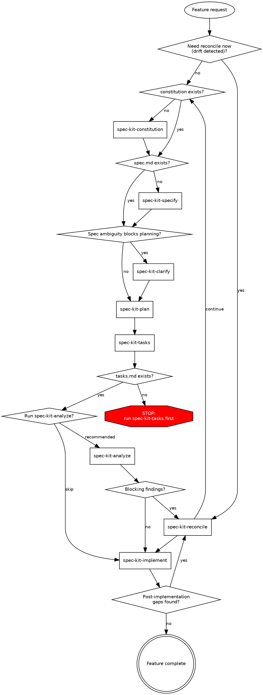

# Spec Kit Skill Router

Route requests to the smallest set of installed `spec-kit-*` skills.
Treat routes as defaults; if repository constraints require a different sequence, state the deviation and risk.

## Invocation Notice

- Inform the user when this skill is invoked by name: `spec-kit`.

## Trigger Tests

- Should trigger:
  - "Which spec-kit skill should I run next?"
  - "Route this feature request through Spec Kit."
  - "I have `tasks.md`; can we implement now?"
- Should not trigger:
  - "Write a Conventional Commit message."
  - "Debug Python concurrency bugs unrelated to Spec Kit."

## Route by Intent

| User Intent                                      | Route                   | Required artifacts                      |
| ------------------------------------------------ | ----------------------- | --------------------------------------- |
| Create or update governance/principles           | `spec-kit-constitution` | none                                    |
| Draft or revise feature requirements             | `spec-kit-specify`      | constitution recommended                |
| Resolve high-impact ambiguity before planning    | `spec-kit-clarify`      | `spec.md`                               |
| Produce technical design artifacts               | `spec-kit-plan`         | `spec.md` + constitution                |
| Generate dependency-ordered implementation tasks | `spec-kit-tasks`        | `plan.md` (+ `spec.md`)                 |
| Audit cross-artifact consistency (read-only)     | `spec-kit-analyze`      | `spec.md` + `plan.md` + `tasks.md`      |
| Reconcile specification drift at any stage       | `spec-kit-reconcile`    | gap report + existing feature artifacts |
| Generate requirements-quality checklist          | `spec-kit-checklist`    | `spec.md`                               |
| Execute implementation from tasks                | `spec-kit-implement`    | `tasks.md`                              |

## Routing Flowchart

Use this for feature-work sequencing.
Gate checks are mandatory.

## Sequence Rules

1. Never run `spec-kit-plan` without `spec.md`.
2. Never run `spec-kit-implement` without `tasks.md`.
3. Run `spec-kit-clarify` before planning when ambiguity can change architecture, data model, testing, UX, operations, or compliance.
4. Run `spec-kit-reconcile` whenever drift is detected at any stage before continuing.

## Router Behavior

1. Classify user intent first, then select one or more child skills from the route table.
2. Enforce artifact gates before invoking downstream skills.
3. Prefer the minimal next step; do not run the full pipeline unless requested.
4. If the requested step violates a gate, route to the missing prerequisite and explain the dependency.
5. Route developer-reported drift directly to `spec-kit-reconcile`, even if raised outside analyze/implement.

## Shared Resource Ownership (Parent Skill)

- `skills/spec-kit/scripts/*` is the source of truth for shared shell helpers.
- Child skills may symlink these scripts; preserve script names and argument contracts unless all dependent children are updated together.
- `skills/spec-kit/references/spec-kit-workflow.dot` is shared by symlink in multiple child skills and must stay router-accurate.

## Unsupported in This Repo

- `spec-kit-taskstoissues` is not supported.
- If the user asks for GitHub issue export from `tasks.md`, state that no `spec-kit-*` exporter skill is available and continue with manual guidance or available skills.

## References

- `references/spec-kit-workflow.dot`
- Upstream baseline: `https://github.com/github/spec-kit` (snapshot: `9111699cd27879e3e6301651a03e502ecb6dd65d`)
